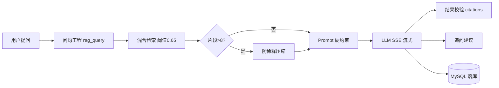

# 项目交付总览

> **项目**：HaiCiAgent — 企业级 RAG 智能知识问答平台  
> **版本**：2026-06-16  
> **定位**：面向 IT 运维与业务支持场景，提供可审计、可溯源的私有化知识问答服务  
> **详细说明**：[项目说明.md](../项目说明.md)

---

## 1 建设背景与业务价值

企业一线支持每天面对大量重复咨询：产品功能、操作流程、故障处理、政策条款分散在多份 PDF、Word、Wiki 中。人工检索慢、新人上手难；若直接使用公网大模型，又存在**编造内部规则**的合规风险。

HaiCiAgent 的建设目标是：

1. **降本**：将常见咨询转为自助问答，释放支持人力
2. **增效**：秒级检索 + 流式回答，缩短 MTTR（平均解决时间）
3. **合规**：回答必须附带知识库引用，空检索明确告知而非臆造
4. **可运营**：会话留存、反馈统计、趋势分析，驱动知识库持续迭代

---

## 2 技术选型与架构决策

| 层级 | 选择 | 决策理由 |
|------|------|----------|
| 后端 | FastAPI | 原生 async + SSE，适合长连接流式对话 |
| 前端 | Vue 3 + TS | 组件化、类型安全，便于 SSE 事件解析 |
| 关系库 | MySQL 8 | 会话、消息、权限、审计日志强一致存储 |
| 向量库 | Chroma HTTP | 适合前期中小量产品快速验证，Docker 一键启动 |
| LLM | DeepSeek-V4-flash（火山方舟 ARK） | 响应快，OpenAI 兼容网关按 task_type 路由 |
| Embedding | bge-large-zh-v1.5 本地快照 | 中文检索为主，本地缓存无 GPU |
| RAG 实现 | 自研 Pipeline | 问句工程 + 混合粗排 + 空检索短路 + 引用溯源，全链路可控 |

完整架构见 [AI架构设计.md](../docxl/AI架构设计.md)；RAG 搭建与评估见 [项目说明.md](../项目说明.md) 章节 2。

---

## 3 核心业务能力链路

**设计原则**（与 [项目说明.md](../项目说明.md) 章节 3.1 一致）：

- **空检索 = 一等公民分支**：不调 LLM，返回可配置兜底话术，杜绝编造
- **引用必须可回溯**：SSE 推送 `citations`，正文 `[1][2]` 可展开对照原文
- **流式必须真实 token**：全部来自 LLM API，无模板模拟
- **问句工程先行**：改写 + 关键词 + 检索词 → 再混合检索，降低幻觉

代码入口：`backend/app/routers/chat.py` → `agent_pipeline.py`

---

## 4 扩展能力

| 能力 | 业务价值 | 实现要点 |
|------|----------|----------|
| 意图识别 | 分流产品/售后/投诉；闲聊极窄 | 规则 + Greedy JSON，`intent.py` |
| 追问引导 | 降低用户二次提问成本 | `follow_up.py`，2–3 条建议 |
| 意图纠偏 | 用户点踩后选正确意图 | `intent_suggest.py` |
| 管理后台 | 服务质量可视化 | 反馈聚合、运维评测 |
| 多知识库路由 | 多产品线文档隔离 | `kb_router.py`，二次选库 |
| 防注意力稀释 | 大库场景关键规则不遗漏 | `context_anti_dilution.py` |
| JSON 格式固化 | 预处理/追问/纠偏稳定可解析 | `structured_json.py` |

详见 [项目说明.md](../项目说明.md) 章节 3.2。

---

## 5 AI 工程保障

与 [项目说明.md](../项目说明.md) 章节 3.1 三类问题一致：

| 问题 | 策略 | 业务意义 |
|------|------|----------|
| **检索为空** | 不调大模型，返回可配置兜底话术；低分触发知识库二次路由 | 避免编造政策，满足合规要求 |
| **上下文超长** | 会话任务小粒度 + 短期记忆（防稀释、滑动窗口）+ 长期记忆（MySQL）+ 检索渐进加载 | 大知识库场景下仍保证关键规则不被遗漏 |
| **大模型幻觉** | 检索层：问句工程 + 阈值 0.65；生成层：提示词硬约束 + 引用溯源；结果校验：忠实度/扎根度 + 追问/意图纠偏 | 每句论断可回溯；低忠实度可观测、可迭代 |

详细说明：[AI架构设计.md](../docxl/AI架构设计.md) 章节 9、[项目说明.md](../项目说明.md) 章节 3。

---

## 6 质量验证

| 维度 | 结果 |
|------|------|
| 自动化回归 | **159 passed**（见 [回归测试报告](./回归测试报告-2026-06-16.md)） |
| 结构化 QA | [RAG测试文档/rag_qa_testset.json](../RAG测试文档/rag_qa_testset.json)（约 30 条） |
| JSON 坏例回归 | `backend/tests/test_structured_json_bad_cases.py` |
| 功能对照 | [PRD功能对照与验收清单.md](./PRD功能对照与验收清单.md) |
| RAG 评估方法 | [项目说明.md](../项目说明.md) 章节 2.3 |

---

## 7 文档清单

| # | 文档 | 路径 | 用途 |
|---|------|------|------|
| 1 | 项目说明 | [项目说明.md](../项目说明.md) | 技术选型、RAG 工程、业务思考、AI 工具认知 |
| 2 | 运行指南 | [运行指南.md](../运行指南.md) | 部署启动 |
| 3 | API 文档 | [API文档.md](../docxl/API文档.md) | 接口 + SSE 格式 |
| 4 | 数据库设计 | [数据库设计.md](../docxl/数据库设计.md) | ER + 表结构 |
| 5 | AI 架构设计 | [AI架构设计.md](../docxl/AI架构设计.md) | RAG 流程 + 模块映射 |
| 6 | 业务流程说明 | [业务流程说明.md](../docxl/业务流程说明.md) | 时序图 |
| 7 | 功能对照清单 | [PRD功能对照与验收清单.md](./PRD功能对照与验收清单.md) | 验收矩阵 |
| 8 | 回归测试报告 | [回归测试报告-2026-06-16.md](./回归测试报告-2026-06-16.md) | 测试证据 |
| 9 | 环境变量 | [.env.example](../.env.example) | 配置模板 |
| — | 开发过程文档 | [dev-process-docs/](../dev-process-docs/) | SPEC / PRD / PLAN 等 |

---

## 8 后续演进方向

1. Cross-Encoder Reranker 提升检索精度（当前为混合粗排，非精排）
2. 树形业务术语表 + 用户纠偏沉淀 Query 业务属性
3. 前端 E2E（Playwright）SSE 视觉回归
4. Groundedness 评测指标接入 CI
