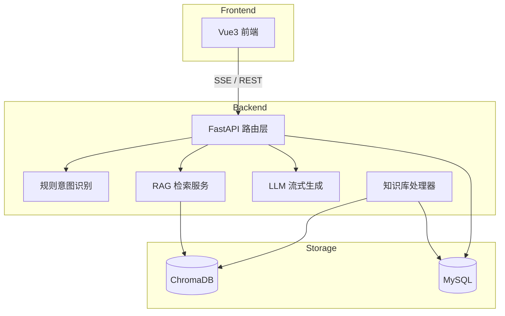

# AI 架构设计

## 总体架构

## RAG 流程

1. **文档入库**：上传 txt/md/pdf → 文本抽取 → 分块（chunk）→ Embedding → 写入 Chroma
2. **问题检索**：用户提问 → Embedding 查询向量库 → Top-K 相关片段
3. **Prompt 组装**：系统指令 + 检索上下文 + 用户问题
4. **流式生成**：调用 OpenAI 兼容 API，SSE 逐 token 推送至前端

## 意图识别

采用**规则引擎**（非独立 LLM），覆盖 PRD 四类意图：

| 意图 | 触发关键词示例 |
|------|----------------|
| product | 产品、功能、介绍 |
| after_sale | 退货、换货、售后 |
| order | 订单、物流、发货 |
| general | 默认兜底 |

意图结果用于 Prompt 微调与前端展示，不参与工具调用。

## 关键设计决策

| 决策 | 选型 | 理由 |
|------|------|------|
| 向量库 | Chroma HTTP | PRD 要求、部署轻量 |
| 检索策略 | 单向量 Top-K | MVP 足够，无 ES/Reranker |
| 会话记忆 | 进程内 + MySQL 持久化 | 去除 Redis 依赖 |
| LLM | 云端 API | 无 GPU 本地推理 |
| Embedding | bge-small-zh CPU | 中文场景、低资源 |

## 模块映射

| 模块 | 路径 |
|------|------|
| 配置 | `backend/app/config.py` |
| LLM 调用 | `backend/app/llms.py` |
| 意图 | `backend/app/intent.py` |
| RAG | `backend/app/rag.py` |
| 向量库 | `backend/app/vectorstore.py` |
| 对话编排 | `backend/app/dialog.py` |
| 知识库处理 | `backend/app/services/knowledge_processor.py` |
