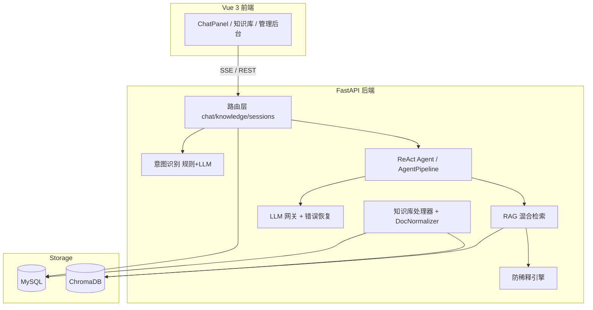
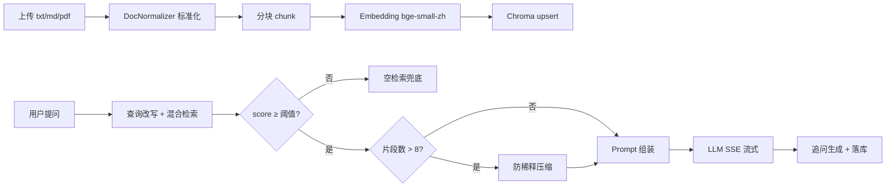

# AI 架构设计

## 总体架构（2026-06 交付版）

```mermaid
flowchart TB
    subgraph Frontend["Vue 3 前端"]
        UI[ChatPanel / 知识库 / 管理后台]
    end
    subgraph Backend["FastAPI 后端"]
        API[路由层 chat/knowledge/sessions]
        Intent[意图识别 规则+LLM]
        Agent[ReAct Agent / AgentPipeline]
        RAG[RAG 混合检索]
        AD[防稀释引擎]
        LLM[LLM 网关 + 错误恢复]
        KB[知识库处理器 + DocNormalizer]
    end
    subgraph Storage
        MySQL[(MySQL)]
        Chroma[(ChromaDB)]
    end
    UI -->|SSE / REST| API
    API --> Intent
    API --> Agent
    Agent --> RAG
    RAG --> Chroma
    RAG --> AD
    Agent --> LLM
    KB --> Chroma
    KB --> MySQL
    API --> MySQL
```

## RAG 完整流程

```mermaid
flowchart LR
    A[上传 txt/md/pdf] --> B[DocNormalizer 标准化]
    B --> C[分块 chunk]
    C --> D[Embedding bge-small-zh]
    D --> E[Chroma upsert]
    F[用户提问] --> G[查询改写 + 混合检索]
    G --> H{score ≥ 阈值?}
    H -->|否| I[空检索兜底]
    H -->|是| J{片段数 > 8?}
    J -->|是| K[防稀释压缩]
    J -->|否| L[Prompt 组装]
    K --> L
    L --> M[LLM SSE 流式]
    M --> N[追问生成 + 落库]
```

### 步骤说明

1. **文档入库**：`knowledge_processor.py` 调度 `doc_normalizer.py`（PDF 可走 pypdf/MinerU）→ 分块 → Embedding → Chroma
2. **问题检索**：`rag.py` 调用 `rag_hybrid_scorer.py`（向量分 + 关键词分）→ `rag_gradient_filter.py` 梯度截断
3. **Prompt 组装**：`prompt_segments.py` 分段注入系统约束 + 检索上下文 + 历史
4. **流式生成**：`llms.py` OpenAI 兼容 stream → SSE `event:token`
5. **Agent 模式**（可选）：`react_agent.py` 将 RAG 封装为 tool，多轮 Observe-Act

## 意图识别

**规则快路径 + LLM 精修**（PRD 加分项）：

| 意图 | 规则关键词 | LLM 标签 |
|------|-----------|----------|
| product | 产品、功能、介绍 | 产品咨询 |
| after_sale | 退货、换货、售后 | 售后问题 |
| order | 订单、物流、发货 | 订单物流 |
| complaint | 投诉、差评 | 投诉 |
| general | 默认 | 闲聊/通用 |

结果通过 SSE `meta.intent` 返回，持久化至 `chat_messages.intent`。

## Prompt 模板设计

System Prompt 由 `prompt_segments.py` 模块化拼接：

| 段 | 作用 |
|----|------|
| `CNSTR_ONLY_FROM_KB` | 仅依据知识库回答 |
| `CNSTR_STATE_UNCERTAINTY` | 资料不足时明确说明 |
| `CITE_NO_FABRICATION` | 禁止编造引用 |
| RAG 上下文块 | `[1] 文档名: 片段...` 编号格式 |
| 历史消息 | 最近 N 轮 user/assistant |

用户问题置于 messages 末尾，检索片段在 system 与 history 之间，保证「规则在前、证据居中、问题在后」。

## 向量检索策略

| 参数 | 默认值 | 说明 |
|------|--------|------|
| `RAG_TOP_K` | 3 | 向量召回条数 |
| `RAG_SCORE_THRESHOLD` | 0.35 | 低于阈值视为不相关 |
| `max_slices` | 8 | 进入 LLM 的最大片段数 |
| 混合权重 | vec 0.7 + kw 0.3 | `rag_hybrid_scorer.py` |

**为何 Top-K=3 而非 10**：MVP 阶段控制 Prompt 长度；超过 8 条走防稀释而非无脑增大 K。

**为何阈值 0.35**：bge-small-zh 在 FAQ 测试集上，0.5 空检索过多，0.35 平衡召回与精度。

## 防注意力稀释（加分项 5）

当检索片段 > 8：

1. 按 `document_id` 分组，最多 5 组
2. 组内按 `score*0.6 + keyword*0.4` 排序
3. 抽取「必须/禁止/编号」类规则句
4. LLM 生成分层摘要 → 压缩上下文
5. 失败时降级为原始 Top 排序，不阻塞主链路

代码：`context_anti_dilution.py`

## 关键设计决策

| 决策 | 选型 | 理由 |
|------|------|------|
| 向量库 | Chroma HTTP | PRD 要求、Docker 一键部署 |
| 检索策略 | 向量 + 关键词混合 | 无 GPU Reranker 下的轻量增强 |
| 会话记忆 | SessionContextManager + MySQL | 去 Redis，窗口预算可配置 |
| LLM | 云端 OpenAI 兼容 API | 无本地 GPU |
| Embedding | bge-small-zh CPU | 中文客服、低资源 |
| 流式 | SSE | PRD 推荐，比 WS 简单 |
| 空检索 | 短路不调 LLM | 防幻觉第一原则 |

## 异常处理

| 场景 | 行为 | 模块 |
|------|------|------|
| LLM 超时/限流 | 重试 + 友好错误 SSE | `llm_error_recovery.py` |
| Chroma 不可用 | 降级空检索 → 兜底话术 | `rag.py safe_retrieve` |
| 防稀释 LLM 失败 | 用原始片段排序 | `context_anti_dilution.py` |
| Embedding 未加载 | 日志告警，关键词降级 | `vectorstore.py` |

## 模块映射

| 模块 | 路径 |
|------|------|
| 配置 | `backend/app/config.py` |
| LLM 调用 | `backend/app/llms.py` |
| LLM 网关 | `backend/app/services/llm_gateway.py` |
| 意图 | `backend/app/intent.py` |
| RAG 检索 | `backend/app/rag.py` |
| 混合评分 | `backend/app/services/rag_hybrid_scorer.py` |
| 梯度过滤 | `backend/app/services/rag_gradient_filter.py` |
| 防稀释 | `backend/app/services/context_anti_dilution.py` |
| ReAct Agent | `backend/app/services/react_agent.py` |
| RAG Tool | `backend/app/services/rag_tool.py` |
| 对话编排 | `backend/app/services/agent_pipeline.py` |
| 会话上下文 | `backend/app/services/session_context_manager.py` |
| Prompt 段 | `backend/app/services/prompt_segments.py` |
| 向量库 | `backend/app/vectorstore.py` |
| 知识库处理 | `backend/app/services/knowledge_processor.py` |
| 文档标准化 | `backend/app/services/doc_normalizer.py` |
| 流式入口 | `backend/app/routers/chat.py` |
