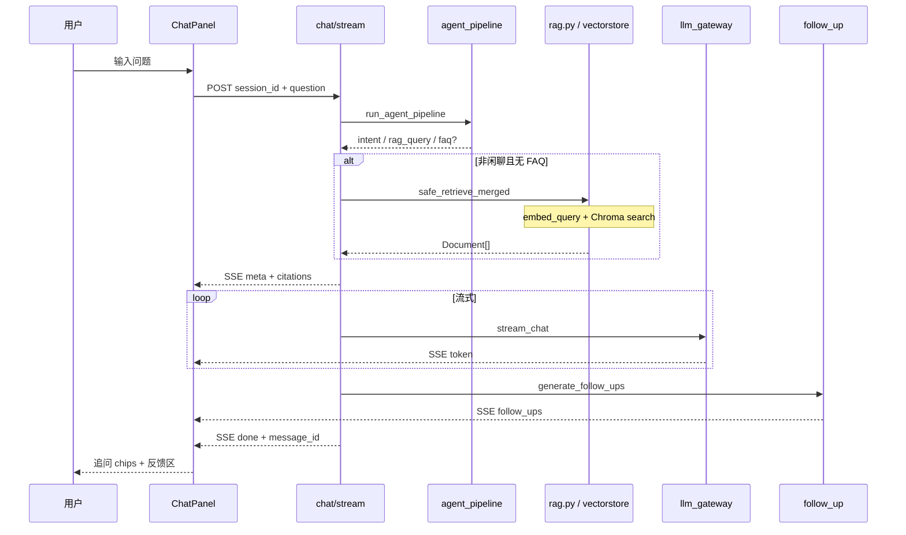

# SPEC · RAG 问答全链路（对话 · 意图 · 反馈 · 追问）

> **模块**：AI 智能客服 · RAG 对话主链路  
> **PRD 真源（只读，只补充不修改）**：`docs/HaiCi笔试_AI 智能客服系统_PRD.md`  
> **关联 SPEC**：`SPEC-AI问答Agent.md`（Pipeline 节点）、`SPEC-RAG文档标准化.md`（入库）、`SPEC-会话持久化.md`  
> **关联实现**：`backend/app/routers/chat.py`、`rag.py`、`services/agent_pipeline.py`、`services/follow_up.py`、`services/term_dictionary.py`

---

## 0. 文档元数据、摘要与定位

### 一句话摘要

将 PRD 中 **RAG 智能问答** 与 **对话体验加分项**（意图识别、追问引导、用户反馈）整合为一条可验收的端到端规格：从用户提问经 Pipeline 检索生成，到回答后追问建议与意图/满意度反馈；并明确 **「意图理解有误」** 时的备选意图引导（术语表优先 → LLM 推测 → 用户自选/自填）及与运维评测看板的数据闭环。

### 分类路径

`产品研发` → `SPEC·PRD` → `HaiChiAgent/RAG问答全链路` → `chat · feedback · follow_up`

| 层级 | 值 |
|------|-----|
| L1 领域 | 产品研发 |
| L2 类型 | SPEC·实施规格 |
| L3 模块 | HaiChiAgent / RAG 问答全链路 |
| L4 | `chat.py` · `ChatPanel` · `ChatAssistantMessage` · `follow_up.py` |

### 版本与修订（Git 式）

| 字段 | 值 |
|------|-----|
| doc_version | v0.1 |
| status | 草案 · 待 Owner 评审 |
| created_at | 2026-06-12T18:30:00+08:00 |
| updated_at | 2026-06-12T18:30:00+08:00 |
| author | Cursor Agent (draft) |
| reviewer | _待指派_ |
| git_branch | feature/haici-mvp |
| git_commit | N/A |

---

## 目录

- [0. 文档元数据、摘要与定位](#0-文档元数据摘要与定位)
- [1. Goal 与 PRD 映射总表](#1-goal-与-prd-映射总表)
- [2. RAG 端到端链路（必达）](#2-rag-端到端链路必达)
- [3. 意图识别与 Pipeline](#3-意图识别与-pipeline)
- [4. 追问引导（PRD 加分项）](#4-追问引导prd-加分项)
- [5. 用户反馈与「意图理解有误」纠偏](#5-用户反馈与意图理解有误纠偏)
- [6. 运维评测与 EVAL 埋点](#6-运维评测与-eval-埋点)
- [7. SSE 与 API 契约](#7-sse-与-api-契约)
- [8. 实现状态矩阵（代码对照）](#8-实现状态矩阵代码对照)
- [9. 分期实施计划（PLAN 预览）](#9-分期实施计划plan-预览)
- [10. 执行抉择与 WARNING](#10-执行抉择与-warning)
- [11. Open Questions](#11-open-questions)
- [待二次审阅（由 Owner 回填）](#待二次审阅由-owner-回填)

---

## 1. Goal 与 PRD 映射总表

| PRD 章节 | 要求摘要 | 本 SPEC 章节 | 实现状态 |
|----------|----------|--------------|----------|
| §2 知识库 | txt/md/pdf 解析向量化、列表、删除同步向量 | 见 `SPEC-RAG文档标准化.md` | ✅ 主链路已有 |
| §2 智能问答 | 检索 → Prompt → LLM → **SSE 流式** | §2 | ✅ |
| §2 智能问答 | 展示引用来源（文档名 + 片段） | §2.3 | ✅ citations + 文献切片 UI |
| §2 智能问答 | 多轮对话最近 N 轮 | §2.4 | ✅ `CHAT_HISTORY_TURNS` |
| §2 业务规则 | 500 字上限、空检索兜底、日限额 100 | §2.5 | ✅ |
| §3 加分 · 意图识别 | 分类并标注会话记录 | §3 | ✅ 规则 + LLM 预处理 |
| §3 加分 · **追问引导** | 回答后 **2～3 条**可点击追问 | §4 | ✅ 前后端 SSE + chip |
| §3 加分 · 管理后台 | 会话、反馈统计 | §6 + 反馈看板 SPEC | ✅ 运维评测模块 |
| §3 加分 · 多知识库路由 | 自动选库 | §2.6 | 🔲 未做 |
| 评估 · 幻觉/空检索 | Prompt 约束 + 兜底 | §2.5 | ✅ |
| 评估 · 大规模上下文 | 防注意力稀释 | §2.7 | ⚠️ 初版 Top-K + 截断 |
| **产品增补** | **意图理解有误 → 备选意图引导** | §5.3 | ✅ |
| **产品增补** | 满意度 1～5 星 + 补充说明 | §5.2 | ✅ |

---

## 2. RAG 端到端链路（必达）

### 2.1 流程图（Mermaid）



### 2.2 向量检索两阶段（工程说明）

| 阶段 | 时机 | 动作 | 代码 |
|------|------|------|------|
| **入库** | 文档上传/处理完成 | `embed_documents` → 写入 Chroma | `vectorstore.add_documents` |
| **问答** | 每次用户提问 | `embed_query` → 相似度检索 | `vectorstore.search` |

问答链路 **必须在应用层** 对问题做 embedding，否则无法向量检索；EVAL 看板中 **`rag` 指标**已包含 embed + 检索整段 RTT（`embedding` 分项可选展示）。

### 2.3 引用展示（对齐 web_rebuild）

| 能力 | 要求 | 实现 |
|------|------|------|
| SSE 下发 | `citations` / `slices` 完整文献块 | `chat.py` → `rag_slices_from_docs` |
| 正文标注 | `[n]` 从 1 起，对应切片 | `rag_slice_utils.build_rag_llm_blocks` |
| 前端折叠 | 文献切片明细 + 逻辑注释面板 | `ChatAssistantMessage.vue` |
| MD 渲染 | 助手正文 Markdown | `renderMarkdown.ts` |

### 2.4 多轮上下文

- 选取最近 `CHAT_HISTORY_TURNS` 轮，字符预算 `history_char_budget()`。
- 闲聊与 RAG 分支均携带裁剪后 history。

### 2.5 业务规则与兜底

| 规则 | 配置/实现 |
|------|-----------|
| 提问 ≤500 字 | `MAX_QUESTION_LENGTH` 前后端校验 |
| 空检索 | `FALLBACK_NO_CONTEXT`，禁止编造 |
| 日限额 | `rate_limit.py`，默认 100/用户/日 |
| 流式 | 必须 SSE `token` 逐片，禁止假 sleep 假流 |

### 2.6 多知识库路由（PRD 加分 · 未做）

- 现状：Chroma `tenant_id` 默认 `str(user_id)`，单 collection `kb_main`。
- 目标：多 collection / 路由模型，按意图或 Query 选库（**本期 SPEC 仅占位，见 §11 Q3**）。

### 2.7 大规模上下文防稀释（PRD 加分 · 初版）

| 策略 | 现状 | 目标增强 |
|------|------|----------|
| Top-K + 阈值 | `RAG_TOP_K=4`, `RAG_SCORE_THRESHOLD=0.35` | Owner 调参 |
| 多 query 合并 | `retrieve_merged` 拆词多路检索 | ✅ |
| 片段截断 | `build_rag_llm_blocks` 预算 | ✅ |
| 规则优先级 / 分层摘要 | 未做 | PLAN Phase 3 可选 |

---

## 3. 意图识别与 Pipeline

固定节点串行（**禁止 LangGraph 假步骤**），详见 `SPEC-AI问答Agent.md` §3。

```text
[1] 意图识别   intent.py + LLM JSON 预处理
[2] Query 改写 rewritten_query（指代消解）
[3] 关键词     query_keywords
[4] 术语映射   term_dictionary.TERM_DICTIONARY / map_retrieval_terms
[5] RAG 检索   safe_retrieve_merged(rag_query)
[6] Prompt     build_prompt_messages + 引用指令
[7] LLM 流式  stream_chat（真实调用）
[8] 追问       generate_follow_ups（真实 LLM，见 §4）
```

**意图枚举（内部 code → 中文）** — `term_dictionary.INTENT_LABELS`：

| code | 中文 |
|------|------|
| product_consult | 产品介绍 |
| after_sale | 售后问题 |
| chitchat | 闲聊 |
| complaint | 投诉 |

SSE `meta` 下发 `intent`、`intent_label`、`pipeline`（改写词、rag_query 等），并写入 `ChatMessage.intent_label`。

---

## 4. 追问引导（PRD 加分项）

### 4.1 产品要求（PRD 原文）

> AI 回答结束后，自动生成 **2～3 个**相关的追问建议供用户 **点击**。

### 4.2 后端（已实现）

| 项 | 说明 |
|----|------|
| 服务 | `services/follow_up.py` → `generate_follow_ups(question, answer, intent)` |
| 调用时机 | `chat/stream` 在流式正文完成后、`done` 之前 |
| LLM | 真实 `get_llm().call`，输出 JSON 数组，2～3 条，每条 ≤20 字 |
| 跳过条件 | 无 answer / 过短 / FAQ 直出分支 |
| SSE | `event: follow_ups`，body `{ "items": ["...", "..."] }` |

### 4.3 前端（已实现）

| 项 | 要求 | 状态 |
|----|------|------|
| 解析 SSE | `ChatPanel.vue` 监听 `follow_ups` | ✅ |
| UI | chip 按钮 2～3 个 | ✅ |
| 交互 | 点击 chip 立即 `sendMessage` | ✅ |

**验收**：人工对话后可见可点追问，点击能发起新一轮 RAG 问答。

---

## 5. 用户反馈与「意图理解有误」纠偏

### 5.1 反馈结构（已实现）

每条 assistant 消息反馈包含：

| 字段 | 说明 | 存储 |
|------|------|------|
| `rating` | 1～5 星满意度 | `message_feedback.rating` |
| `intent_liked` | true=理解准确 / false=理解有误 | `message_feedback.intent_liked` |
| `comment` | 补充说明 ≤500 字 | `message_feedback.comment` |
| `context_snapshot` | 提问/回答/意图/会话摘要 | JSON 字段 |

前端：`ChatAssistantMessage.vue`；API：`POST /api/v1/feedback/messages/{id}`。  
管理端：运维评测 → 用户反馈（列表 + 综合看板），见 `feedback_analytics.py`。

### 5.2 交互现状

- 展示当前轮 **意图识别** 中文标签。
- 👍 理解准确 / 👎 理解有误 二选一（可选，与星级独立）。
- 提交前须选星级。

### 5.3 「意图理解有误」备选意图引导（**已实现**）

当用户点击 **👎 理解有误** 时，在按钮下方 **展开纠偏面板**（不得静默提交）：

#### 5.3.1 备选意图来源（优先级）

| 优先级 | 来源 | 说明 | 数据 |
|--------|------|------|------|
| P0 | **内部意图术语表** | 展示除当前意图外的全部标准意图 | `INTENT_LABELS`（可扩展为配置/file） |
| P1 | **推测意图（LLM）** | 根据 `user_question` + `assistant_answer` 生成 1～2 个 **中文概括** 的候选意图（映射到标准 code 或自由文本） | 新服务 `intent_suggest.py` |
| P2 | **术语表相关检索词** | 从 `TERM_DICTIONARY` / `retrieval_terms` 提示「是否其实想咨询：退换货政策 / 售后服务…」 | 复用 pipeline 输出 |
| P3 | **用户自填** | 单行输入「您认为正确的意图是：___」 | 自由文本 |

#### 5.3.2 UI 行为

```text
[意图识别：产品介绍]  👍准确  👎有误（已选）
  └─ 推测您可能想问的是：（展开面板）
       ○ 售后问题（术语表）
       ○ 投诉（术语表）
       ○ 咨询保修与退换货流程（LLM 推测 · 映射 after_sale）
       ○ 其他：[___________]
     [确认并随反馈提交]
```

- 单选或「其他+自填」；选中项写入反馈 payload。
- 面板仅在 `intent_liked === false` 时出现；改回 👍 则收起并清空纠偏选择。
- 提交反馈时 **必填**：星级 +（若 👎）至少一项纠偏意图（标准 code 或自填文本）。

#### 5.3.3 数据模型扩展（建议）

`FeedbackContextSnapshot` / DB JSON 增加：

| 字段 | 类型 | 说明 |
|------|------|------|
| `detected_intent` | string | 系统识别 code（已有 intent） |
| `detected_intent_label` | string | 系统识别中文 |
| `corrected_intent` | string? | 用户选定标准 code |
| `corrected_intent_label` | string? | 用户选定或自填中文 |
| `intent_suggestions_shown` | string[]? | 下发过的候选（审计） |

可选：`GET /api/v1/chat/intent-alternatives?message_id=` 返回 `{ builtin, suggested, term_hints }`（便于 LLM 推测在后端、前端只渲染）。

#### 5.4 与运维看板闭环

- 反馈看板 **失败意图排行** 已按 `intent_liked=0` 统计。
- 纠偏字段入库后，看板可增加「纠偏后意图分布」与「识别错误 Top 模式」（Phase 2）。

---

## 6. 运维评测与 EVAL 埋点

RAG 主链路调用纳入 **EVAL 评测**（运维评测 → EVAL 评测）：

| api_type | 触发点 | 指标 |
|----------|--------|------|
| `embedding` | `embed_query` / `embed_documents` | RTT、失败率 |
| `rag` | `vectorstore.search` | hits、recall 代理、RTT |
| `llm` | `stream_chat` / pipeline 预处理 | tokens、RTT、失败率 |

- 装饰器：`services/agent_call_logger.track_agent_call`
- 对话 trace：`chat/stream` 设置 `set_agent_trace` + SSE `eval_trace_id`
- 回归：`backend/scripts/regression_eval_monitor.py`

**说明**：问答场景 embedding 为检索必需步骤，与入库 embedding 区分展示，见 §2.2。

---

## 7. SSE 与 API 契约

### 7.1 SSE 事件（完整）

| event | 时机 | payload 要点 | 前端状态 |
|-------|------|--------------|----------|
| `meta` | 流开始 | intent, pipeline, eval_trace_id | ✅ |
| `citations` | 检索后 | items, slices | ✅ |
| `token` | 生成中 | content | ✅ |
| `follow_ups` | 生成后 | items[] | ✅ |
| `done` | 结束 | assistant_message_id | ✅ |

### 7.2 REST（摘录）

| 方法 | 路径 | 说明 |
|------|------|------|
| POST | `/api/v1/chat/stream` | RAG 问答 SSE |
| POST | `/api/v1/feedback/messages/{id}` | 用户反馈 |
| GET | `/api/v1/admin/feedback/analytics` | 看板数据 |
| GET | `/api/v1/admin/eval/overview` | EVAL 指标 |

| GET | `/api/v1/chat/intent-alternatives` | 备选意图（术语表 + LLM 推测） | ✅ |

---

## 8. 实现状态矩阵（代码对照）

| 能力 | 后端 | 前端 | 文档 |
|------|------|------|------|
| RAG 检索 + 流式 | ✅ `chat.py` | ✅ | §2 |
| 文献切片 + MD | ✅ | ✅ | §2.3 |
| Pipeline 五节点 | ✅ `agent_pipeline.py` | meta 展示 | §3 |
| 术语映射 | ✅ `term_dictionary.py` | — | §3 |
| 追问 LLM + 前端 chip | ✅ | ✅ | §4 |
| 意图 👍/👎 + 纠偏面板 | ✅ | ✅ | §5 |
| 意图纠偏 API + LLM 推测 | ✅ `intent_suggest.py` | ✅ | §5.3 |
| 星级 + 补充说明 | ✅ | ✅ | §5 |
| 管理反馈看板 | ✅ | ✅ | §6 |
| EVAL rag/llm | ✅ | ✅ EvalDashboard | §6 |
| 多库路由 | ❌ | — | §2.6 |
| 回归脚本 | ✅ `regression_eval_monitor.py` | — | §6 |

---

## 9. 分期实施计划（PLAN 预览）

> 正式任务拆解见后续 `PLAN-RAG问答全链路.md`（/sepa 产出）。

| Phase | 范围 | 交付 |
|-------|------|------|
| **P0** | 追问引导前端 | ✅ 已完成 |
| **P1** | 意图纠偏 MVP | ✅ 已完成 |
| **P2** | 意图纠偏增强 + 看板纠偏统计 | ✅ 已完成 |
| **P3** | RAG 质量 | Top-K 调参、分层摘要、多库路由 POC |

---

## 10. 执行抉择与 WARNING

| 议题 | 备选 | **采纳（v0.1）** | 顾虑 |
|------|------|------------------|------|
| 追问生成 | 规则模板 / **真实 LLM** | LLM JSON 数组 | 模板违反 no-fake-agent 规则 |
| 意图纠偏 | 仅自填 / **术语表+LLM+自填** | 术语表优先 | 仅 LLM 可能编造业务意图 |
| 纠偏是否重跑问答 | 提交后自动重问 / **仅记录反馈** | 仅记录 | 自动重问需二次 SSE，复杂度高 |
| EVAL embedding 分项 | 独立展示 / **合并进 rag** | 看板 rag 为主 | 用户易误解「应用层为何 embed」 |

**WARNING**

1. 追问与意图推测必须为 **真实 LLM 调用**；失败时 SSE/面板显式降级，禁止假文案。
2. `intent_liked=false` 未选纠偏意图时，前后端应 **校验拦截**，避免空踩。
3. 纠偏数据含 PII 时，看板导出需遵循现有日志脱敏规范。

---

## 11. Open Questions

| ID | 问题 | 建议默认 |
|----|------|----------|
| Q1 | LLM 推测意图是否必须映射到四 enum，还是允许纯中文？ | 优先映射 enum；无法映射时存 `corrected_intent_label` 自由文本 |
| Q2 | 点击追问 chip 是否立即发送？ | 默认立即发送；设置项可改为仅填入输入框 |
| Q3 | 多知识库路由优先级？ | P3 再做；当前 tenant=user_id |
| Q4 | `RAG_TOP_K` / 阈值目标？ | Owner 用样例文档人工回归后回填 |

---

## 待二次审阅（由 Owner 回填）

- [ ] 确认 §5.3 意图纠偏四档优先级是否符合产品预期
- [ ] 确认追问 chip **点击即发送** vs **填入输入框**（见 §11 Q2）
- [ ] `RAG_TOP_K` / `RAG_SCORE_THRESHOLD` 目标值：________
- [ ] 意图术语表是否扩展为外部词库文件（路径）：________
- [ ] P0/P1 排期：`P0 追问前端` ___ 人日；`P1 意图纠偏` ___ 人日
- [ ] 接口冻结责任人：________
- [ ] 见 §11 Q1～Q4，请 Owner 逐条裁决

---

*本 SPEC 整合 PRD RAG 必达与加分项，并纳入「意图理解有误」纠偏与追问引导缺口；Pipeline 节点细节仍以 `SPEC-AI问答Agent.md` 为补充，入库规范以 `SPEC-RAG文档标准化.md` 为准。*
