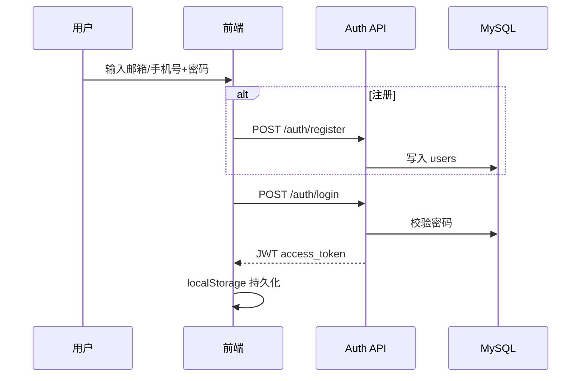
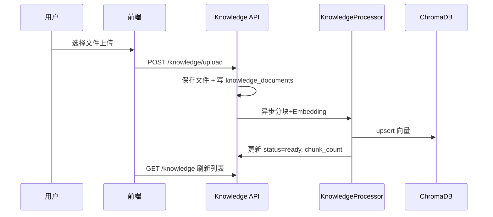
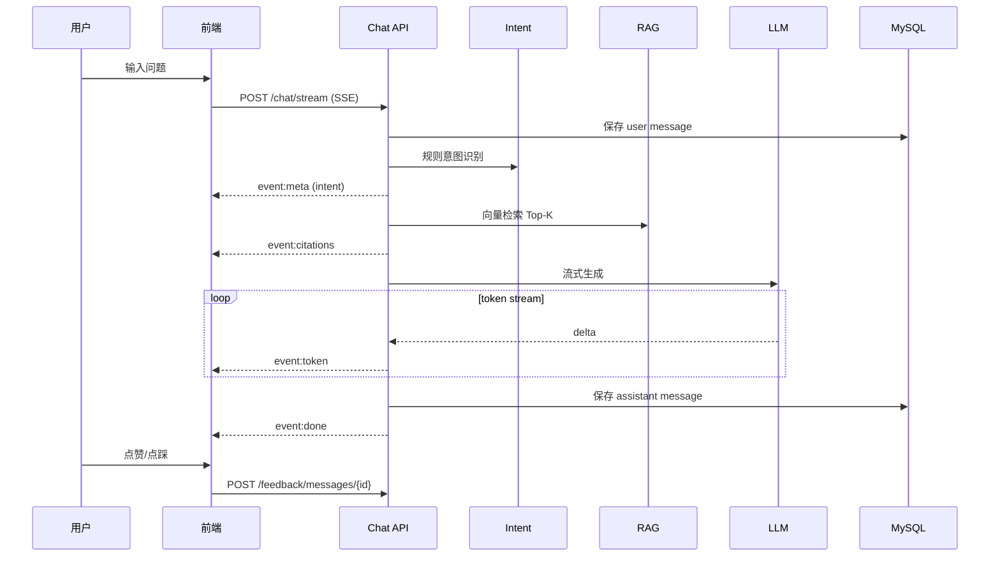

# 业务流程说明

## 用户注册登录

## 知识库上传

## 智能问答（SSE 全链路）

## 限流策略

- 每用户每日提问上限由 `daily_question_usage` 表统计
- 配置项见 `.env.example` 中 `DAILY_QUESTION_LIMIT`
- 超限返回 HTTP 429

## 异常处理

| 场景 | 行为 |
|------|------|
| LLM API 失败 | SSE 推送错误信息，消息标记失败 |
| 知识库为空 | 降级为通用回答并提示上传文档 |
| 未登录 | 401，前端展示登录弹窗 |
| 限流触发 | 429，前端提示次日再试 |
