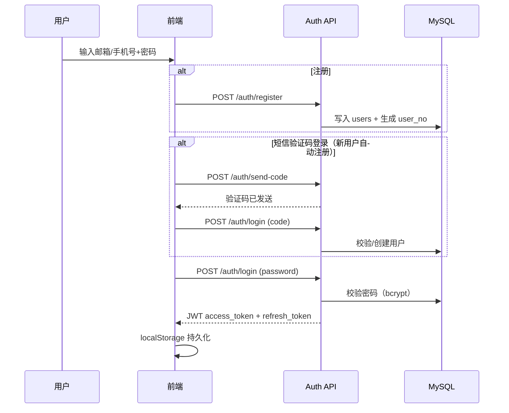
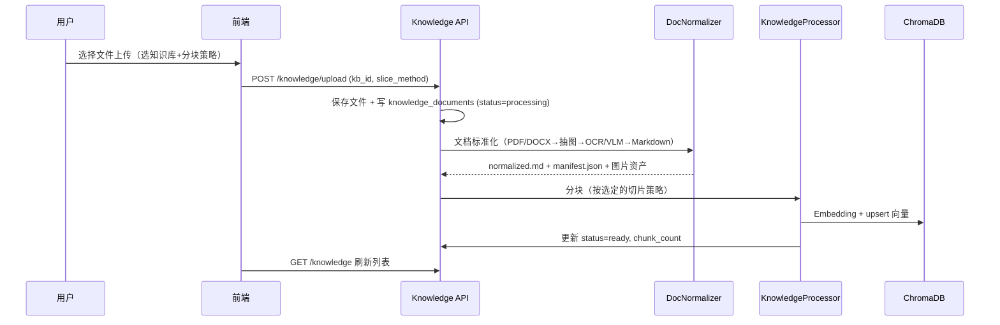
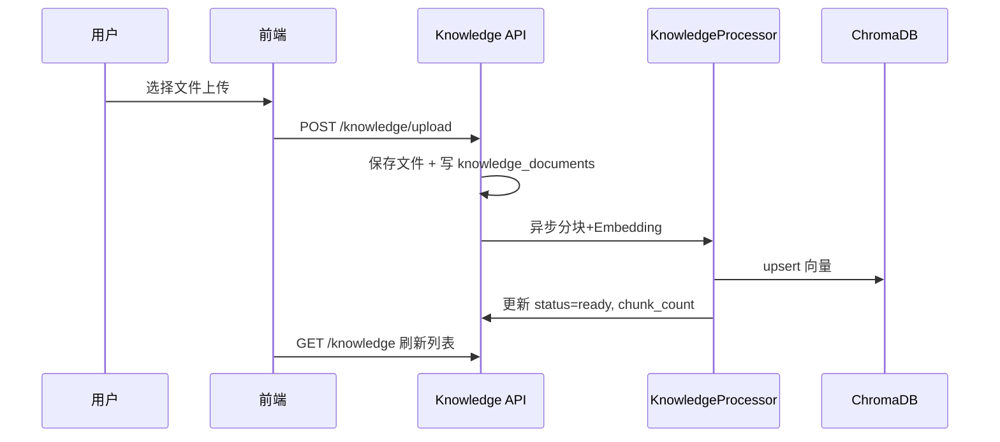
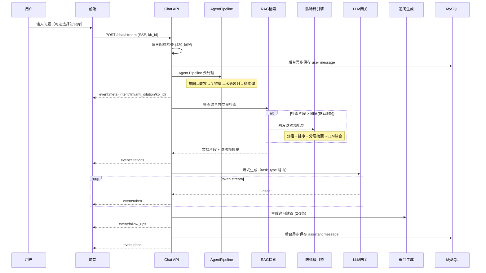
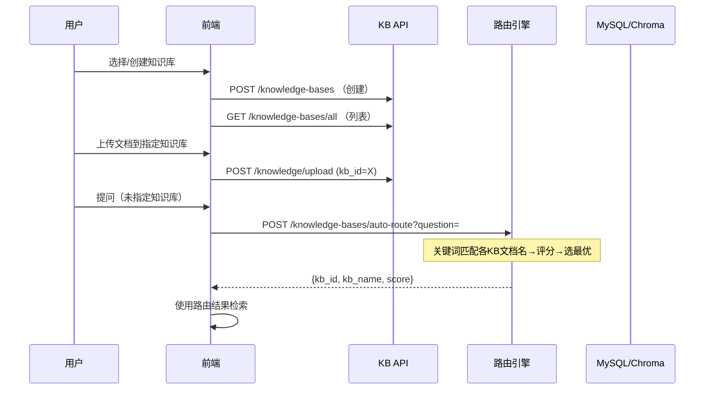
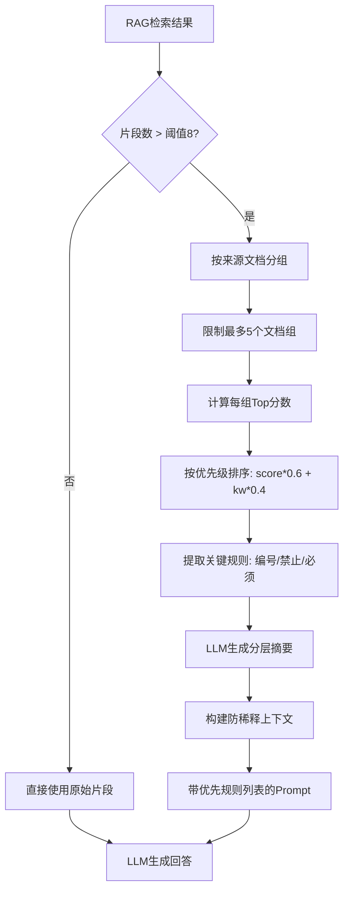
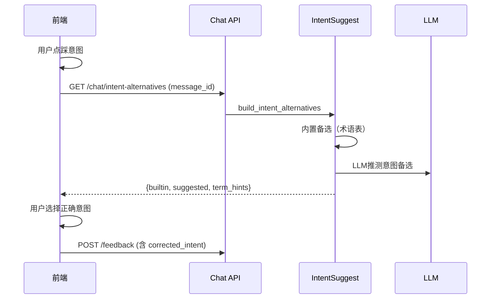

# 业务流程说明

## 用户注册登录

```mermaid
sequenceDiagram
    participant U as 用户
    participant F as 前端
    participant A as Auth API
    participant DB as MySQL

    U->>F: 输入邮箱/手机号+密码
    alt 注册
        F->>A: POST /auth/register
        A->>DB: 写入 users + 生成 user_no
    end
    alt 短信验证码登录（新用户自动注册）
        F->>A: POST /auth/send-code
        A-->>F: 验证码已发送
        F->>A: POST /auth/login (code)
        A->>DB: 校验/创建用户
    end
    F->>A: POST /auth/login (password)
    A->>DB: 校验密码（bcrypt）
    A-->>F: JWT access_token + refresh_token
    F->>F: localStorage 持久化
```

## 知识库上传（含多模态标准化）

```mermaid
sequenceDiagram
    participant U as 用户
    participant F as 前端
    participant K as Knowledge API
    participant N as DocNormalizer
    participant P as KnowledgeProcessor
    participant C as ChromaDB

    U->>F: 选择文件上传（选知识库+分块策略）
    F->>K: POST /knowledge/upload (kb_id, slice_method)
    K->>K: 保存文件 + 写 knowledge_documents (status=processing)
    K->>N: 文档标准化（PDF/DOCX→抽图→OCR/VLM→Markdown）
    N-->>K: normalized.md + manifest.json + 图片资产
    K->>P: 分块（按选定的切片策略）
    P->>C: Embedding + upsert 向量
    P->>K: 更新 status=ready, chunk_count
    F->>K: GET /knowledge 刷新列表
```

## 知识库上传

```mermaid
sequenceDiagram
    participant U as 用户
    participant F as 前端
    participant K as Knowledge API
    participant P as KnowledgeProcessor
    participant C as ChromaDB

    U->>F: 选择文件上传
    F->>K: POST /knowledge/upload
    K->>K: 保存文件 + 写 knowledge_documents
    K->>P: 异步分块+Embedding
    P->>C: upsert 向量
    P->>K: 更新 status=ready, chunk_count
    F->>K: GET /knowledge 刷新列表
```

## 智能问答（SSE 全链路 · 含防稀释与多KB路由）

```mermaid
sequenceDiagram
    participant U as 用户
    participant F as 前端
    participant C as Chat API
    participant P as AgentPipeline
    participant R as RAG检索
    participant AD as 防稀释引擎
    participant L as LLM网关
    participant FU as 追问生成
    participant DB as MySQL

    U->>F: 输入问题（可选选择知识库）
    F->>C: POST /chat/stream (SSE, kb_id)
    C->>C: 每日配额检查 (429 超限)
    C->>DB: 后台异步保存 user message
    C->>P: Agent Pipeline 预处理
    Note over P: 意图→改写→关键词→术语映射→检索词
    C-->>F: event:meta (intent/llm/anti_dilution/kb_id)
    C->>R: 多查询合并向量检索
    alt 检索片段 > 阈值(默认8条)
        R->>AD: 触发防稀释机制
        Note over AD: 分组→排序→分层摘要→LLM综合
    end
    R-->>C: 文档片段 + 防稀释摘要
    C-->>F: event:citations
    C->>L: 流式生成（task_type 路由）
    loop token stream
        L-->>C: delta
        C-->>F: event:token
    end
    C->>FU: 生成追问建议 (2-3条)
    C-->>F: event:follow_ups
    C->>DB: 后台异步保存 assistant message
    C-->>F: event:done
```

## 多知识库路由流程 (PRD 加分项4)

```mermaid
sequenceDiagram
    participant U as 用户
    participant F as 前端
    participant KB as KB API
    participant R as 路由引擎
    participant DB as MySQL/Chroma

    U->>F: 选择/创建知识库
    F->>KB: POST /knowledge-bases （创建）
    F->>KB: GET /knowledge-bases/all （列表）
    U->>F: 上传文档到指定知识库
    F->>KB: POST /knowledge/upload (kb_id=X)
    U->>F: 提问（未指定知识库）
    F->>R: POST /knowledge-bases/auto-route?question=
    Note over R: 关键词匹配各KB文档名→评分→选最优
    R-->>F: {kb_id, kb_name, score}
    F->>F: 使用路由结果检索
```

## 大规模上下文防稀释流程 (PRD 加分项5)

```mermaid
flowchart TD
    A[RAG检索结果] --> B{片段数 > 阈值8?}
    B -->|否| C[直接使用原始片段]
    B -->|是| D[按来源文档分组]
    D --> E[限制最多5个文档组]
    E --> F[计算每组Top分数]
    F --> G[按优先级排序: score*0.6 + kw*0.4]
    G --> H[提取关键规则: 编号/禁止/必须]
    H --> I[LLM生成分层摘要]
    I --> J[构建防稀释上下文]
    J --> K[带优先规则列表的Prompt]
    C --> L[LLM生成回答]
    K --> L
```

## 意图纠偏流程 (PRD 加分项1)

```mermaid
sequenceDiagram
    participant F as 前端
    participant C as Chat API
    participant IS as IntentSuggest
    participant L as LLM

    F->>F: 用户点踩意图
    F->>C: GET /chat/intent-alternatives (message_id)
    C->>IS: build_intent_alternatives
    IS->>IS: 内置备选（术语表）
    IS->>L: LLM推测意图备选
    IS-->>F: {builtin, suggested, term_hints}
    F->>F: 用户选择正确意图
    F->>C: POST /feedback (含 corrected_intent)
```

## 限流策略

- 每用户每日提问上限由 `daily_question_usage` 表统计
- 配置项见 `.env.example` 中 `DAILY_QUESTION_LIMIT`（默认100）
- 超限返回 HTTP 429
- 单次提问不超过 `MAX_QUESTION_LENGTH`（默认500字）

## 异常处理

| 场景 | 行为 |
|------|------|
| LLM API 失败/超时 | SSE 推送错误信息，日志记录 error_type |
| 知识库检索为空 | 返回标准兜底话术 `FALLBACK_NO_CONTEXT`，不编造答案 |
| 向量库不可用 | RAG检索降级为空，返回兜底话术 |
| 防稀释LLM调用失败 | 降级为原始排序结果，不阻塞主流程 |
| 未登录 | 401，前端路由守卫重定向 /login |
| 限流触发 | 429，前端提示次日再试或联系管理员 |
| SSE连接中断 | 前端ReadableStream自动结束，消息通过异步持久化已保存 |
| Embedding模型未加载 | 降级为规则匹配，日志告警 |
