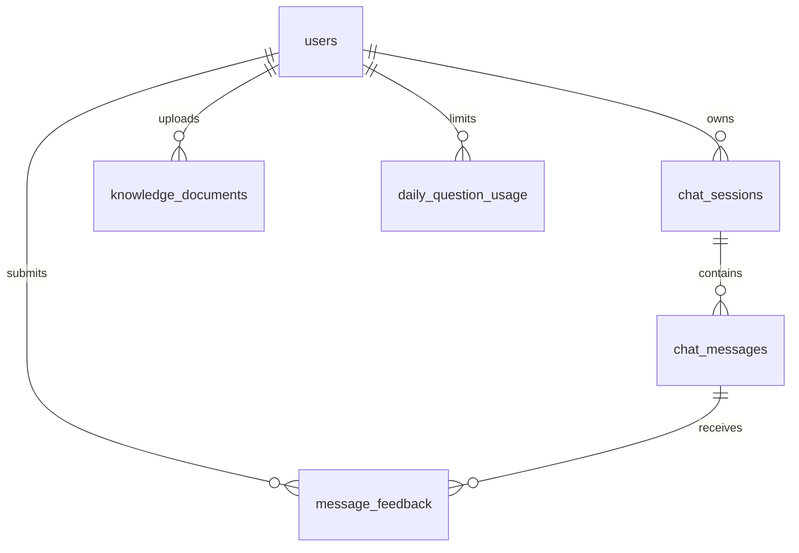

# 数据库设计

## ER 关系概览

## 表结构说明

### users — 用户表

| 字段 | 类型 | 说明 |
|------|------|------|
| id | BIGINT PK | 用户 ID |
| email | VARCHAR(128) UNIQUE | 邮箱（与 phone 二选一） |
| phone | VARCHAR(20) UNIQUE | 手机号 |
| password_hash | VARCHAR(255) | bcrypt 密码哈希 |
| created_at | DATETIME | 注册时间 |

### chat_sessions — 会话表

| 字段 | 类型 | 说明 |
|------|------|------|
| id | BIGINT PK | 会话 ID |
| user_id | BIGINT FK | 所属用户 |
| title | VARCHAR(200) | 会话标题 |
| created_at / updated_at | DATETIME | 创建/更新时间 |

### chat_messages — 消息表

| 字段 | 类型 | 说明 |
|------|------|------|
| id | BIGINT PK | 消息 ID |
| session_id | BIGINT FK | 所属会话 |
| role | ENUM | user / assistant / system |
| content | TEXT | 消息正文 |
| intent_label | VARCHAR(32) | 意图标签 |
| citations_json | JSON | 引用片段列表 |
| created_at | DATETIME | 创建时间 |

### message_feedback — 反馈表

| 字段 | 类型 | 说明 |
|------|------|------|
| id | BIGINT PK | 反馈 ID |
| message_id | BIGINT FK | 关联助手消息 |
| user_id | BIGINT FK | 反馈用户 |
| rating | TINYINT | 1=赞 0=踩 |
| comment | VARCHAR(500) | 可选备注 |

### knowledge_documents — 知识库文档表

| 字段 | 类型 | 说明 |
|------|------|------|
| id | BIGINT PK | 文档 ID |
| user_id | BIGINT FK | 上传用户 |
| filename | VARCHAR(255) | 原始文件名 |
| storage_path | VARCHAR(512) | 本地存储路径 |
| status | ENUM | processing / ready / failed |
| chunk_count | INT | 向量分块数 |
| error_message | VARCHAR(500) | 失败原因 |

### daily_question_usage — 每日提问限流

| 字段 | 类型 | 说明 |
|------|------|------|
| user_id + usage_date | UNIQUE | 用户+日期 |
| question_count | INT | 当日已提问次数 |

## 初始化

建表脚本：`backend/数据库初始化脚本/init.sql`

样例知识库：`backend/数据库初始化脚本/seed_kb/`
