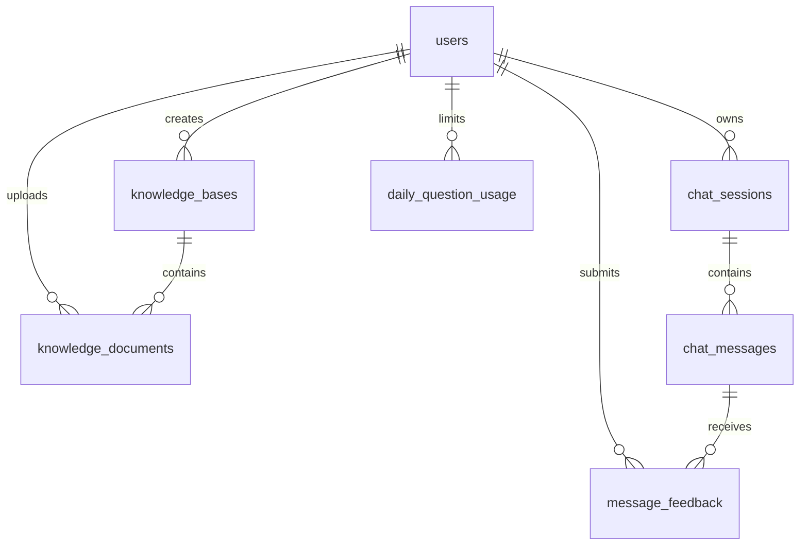

# 数据库设计

## ER 关系概览

```mermaid
erDiagram
    users ||--o{ chat_sessions : owns
    users ||--o{ knowledge_bases : creates
    users ||--o{ knowledge_documents : uploads
    users ||--o{ message_feedback : submits
    users ||--o{ daily_question_usage : limits
    chat_sessions ||--o{ chat_messages : contains
    chat_messages ||--o{ message_feedback : receives
    knowledge_bases ||--o{ knowledge_documents : contains
```

## 表结构说明

### users — 用户表

| 字段 | 类型 | 说明 |
|------|------|------|
| id | BIGINT PK | 用户 ID |
| user_no | VARCHAR(32) UNIQUE | 对外用户编号（SHA-256 哈希生成） |
| username | VARCHAR(64) UNIQUE | 用户名 |
| email | VARCHAR(128) UNIQUE | 邮箱 |
| phone | VARCHAR(20) UNIQUE | 手机号 |
| password_hash | VARCHAR(255) | bcrypt 密码哈希 |
| nickname | VARCHAR(64) | 昵称 |
| avatar_url | VARCHAR(512) | 头像 URL |
| status | TINYINT | 1=正常 |
| created_at | DATETIME | 注册时间 |

### chat_sessions — 会话表

| 字段 | 类型 | 说明 |
|------|------|------|
| id | BIGINT PK | 会话 ID（对外展示） |
| context_id | VARCHAR(36) UNIQUE | 上下文 UUID，跨链路追踪 |
| user_id | BIGINT FK | 所属用户 |
| title | VARCHAR(200) | 会话名称（可编辑/首问截断） |
| meta_json | JSON | 扩展元数据：`message_count` / `last_intent` / `note` / `pinned` |
| status | TINYINT | 1=正常 0=归档（软删） |
| created_at / updated_at | DATETIME | 创建/最后更新时间 |

### chat_messages — 消息表

| 字段 | 类型 | 说明 |
|------|------|------|
| id | BIGINT PK | 消息 ID |
| session_id | BIGINT FK | 所属会话 |
| role | ENUM | user / assistant / system |
| content | TEXT | 消息正文 |
| intent_label | VARCHAR(32) | 意图标签 |
| citations_json | JSON | 引用片段列表 |
| created_at | DATETIME | 创建时间 |

### message_feedback — 反馈表

| 字段 | 类型 | 说明 |
|------|------|------|
| id | BIGINT PK | 反馈 ID |
| message_id | BIGINT FK | 关联助手消息 |
| user_id | BIGINT FK | 反馈用户 |
| rating | INT | 1-5 星级评分 |
| intent_liked | TINYINT | 意图理解是否准确 1=赞 0=踩 |
| context_snapshot_json | JSON | 上下文快照（意图/问题/回答/纠偏信息） |
| comment | VARCHAR(500) | 可选文字反馈 |

### knowledge_bases — 知识库表 (PRD 加分项4)

| 字段 | 类型 | 说明 |
|------|------|------|
| id | BIGINT PK | 知识库 ID |
| user_id | BIGINT FK | 所属用户 |
| name | VARCHAR(128) | 知识库名称 |
| description | VARCHAR(512) | 知识库描述 |
| is_default | TINYINT | 是否默认知识库 1=是 0=否 |
| status | TINYINT | 1=启用 0=禁用 |
| created_at / updated_at | DATETIME | 创建/更新时间 |

### knowledge_documents — 知识库文档表

| 字段 | 类型 | 说明 |
|------|------|------|
| id | BIGINT PK | 文档 ID |
| user_id | BIGINT FK | 上传用户 |
| kb_id | BIGINT FK | 关联知识库（可为空） |
| filename | VARCHAR(255) | 原始文件名 |
| storage_path | VARCHAR(512) | 本地存储路径 |
| status | ENUM | processing / ready / failed |
| chunk_count | INT | 向量分块数 |
| error_message | VARCHAR(500) | 失败原因 |

### daily_question_usage — 每日提问限流

| 字段 | 类型 | 说明 |
|------|------|------|
| user_id + usage_date | UNIQUE | 用户+日期 |
| question_count | INT | 当日已提问次数 |

## 初始化

建表脚本：
- `backend/数据库初始化脚本/init.sql` — 基础建表
- `backend/数据库初始化脚本/migrate_rbac_v1.sql` — RBAC 权限迁移
- `backend/数据库初始化脚本/migrate_chat_sessions_v1.sql` — 会话持久化迁移
- `backend/数据库初始化脚本/migrate_knowledge_base_v1.sql` — 多知识库迁移 (新增)

样例知识库：`backend/数据库初始化脚本/seed_kb/`
