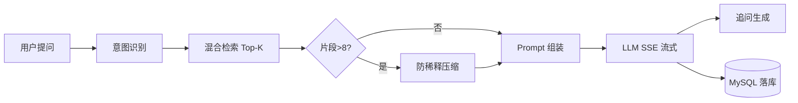

# 面试交付总览（应试者自述）

> **作者角色**：HaiCi 笔试应试学生  
> **项目**：HaiChiAgent — 企业级 RAG 智能客服  
> **日期**：2026-06-16  
> **目的**：向面试官完整呈现「需求理解 → 架构决策 → 实现路径 → 验证闭环 → 反思改进」

---

## 写在前面：我如何理解这道题

PRD 表面是「做一个 ChatGPT 壳 + 上传文档」，但评估权重告诉我真正考察的是：

1. **RAG 链路是否完整可解释**（40%）
2. **AI 工程思维**：空检索、幻觉、上下文截断（25%）
3. **代码与 API 质量**（35%）

因此我没有追求功能堆叠，而是按 **「必做闭环先行 → 加分项有设计文档 → 每项可测」** 的顺序推进，并在文档里把「为什么这样设计」写清楚——这也是我希望在面试中展开的部分。

---

## 一、我的技术选型与理由

| 层级 | 选择 | 为什么不是别的 |
|------|------|----------------|
| 后端 | FastAPI | 原生 async + SSE 友好，比 Flask 少写一层 streaming 适配 |
| 前端 | Vue 3 + TS | PRD 二选一；团队熟悉 Composition API，类型安全利于 SSE 事件解析 |
| 关系库 | MySQL 8 | PRD 硬性要求；会话/消息/反馈天然 relational |
| 向量库 | Chroma HTTP | 本地文件模式即可，docker compose 一键起，比 Milvus 轻 |
| LLM | OpenAI 兼容 API（通义千问） | 免费 tier 可用；`llms.py` 统一适配多厂商 |
| Embedding | bge-small-zh-v1.5 CPU | 中文客服场景够用，无 GPU 部署成本 |
| RAG 框架 | **手写为主** | LangChain 黑盒 Chain 不利于面试讲解；核心 4 步（检索/Prompt/流/落库）均可见代码 |

完整架构图见 [AI架构设计.md](./AI架构设计.md)。

---

## 二、核心链路：我如何实现 RAG（可白板讲解版）



**我的设计原则**：

- **空检索 = 一等公民分支**：不调 LLM，直接 `FALLBACK_NO_CONTEXT`（防幻觉的第一道闸）
- **引用必须可点击回溯**：SSE 先发 `citations`，前端渲染文档名 + 摘要
- **流式必须真 token**：禁止模板 + sleep 假流（见项目规则 `no-fake-agent-steps`）

代码入口：`backend/app/routers/chat.py` → `agent_pipeline.py` / `react_agent.py`

---

## 三、加分项：我如何「超额完成但可控范围」

| 加分项 | 我的思路 | 验证 |
|--------|----------|------|
| 意图识别 | 规则快路径 + LLM 精修；结果写入 `chat_messages.intent` | `test_regression_intent.py` |
| 追问引导 | 回答完成后单独 LLM 调用，SSE `follow_ups` | `test_regression_chat.py` |
| 管理后台 | 反馈聚合 + 日均问答折线，非 mock 数据 | `test_feedback_analytics.py` |
| 多 KB 路由 | 按 KB 名/描述关键词评分 + auto-route API | `test_regression_knowledge_base.py` |
| 防稀释 | 分组→优先级→规则抽取→分层摘要 | `test_regression_anti_dilution.py` |
| ReAct Agent | 检索封装为 tool，模型自主决定何时查库 | `react_agent.py` + 前端思考步骤展示 |

**刻意未做**：PRD「终极挑战·微服务改动拆解」——要求设计思路即可，我在 [面试问答-RAG与Agent.md](./面试问答-RAG与Agent.md) §6 用文字+流程图说明，避免范围失控。

---

## 四、三个 AI 工程难题：我的解法（面试重点）

### 4.1 检索为空

- **问题**：LLM 会用预训练知识「补全」，产生假政策/假参数
- **解法**：`not docs` 时短路，SSE 推送可配置兜底话术
- **验证**：提问库外问题 → 回答不含编造 + citations 为空

### 4.2 上下文超长

- **问题**：多轮 + 大 KB 检索导致超窗口或「Lost in the Middle」
- **解法**：三层预算 — 历史轮次截断（`session_context_manager`）→ Top-K → 防稀释压缩
- **验证**：`test_chat_context_manager.py` + 人工长对话

### 4.3 LLM 幻觉

- **问题**：模型自信胡说
- **解法**：Prompt 硬约束（`prompt_segments.py`）+ 句末引用编号 + 空检索不调模型 + 前端溯源 UI
- **验证**：`RAG测试文档/rag_qa_testset.json` 人工抽检

详细代码级说明：[面试问答-RAG与Agent.md](./面试问答-RAG与Agent.md)

---

## 五、我如何使用 AI 编程工具（PRD 强制说明）

| 工具 | 用途 |
|------|------|
| **Cursor Agent** | 脚手架生成、回归测试补全、文档初稿 |
| **通义千问 API** | 运行时 LLM + Embedding |
| **Claude/ChatGPT** | 架构方案讨论、Prompt 措辞迭代 |

**我对 AI 生成代码的修正（举例）**：

1. **假流式**：初版用 sleep 切片 — 已删除，改为真实 `async for token in llm_stream`
2. **检索阈值**：AI 默认 0.5 过高导致空检索 — 调为 0.35 并用 FAQ 集验证
3. **Chroma metadata**：生成代码未带 `document_id` — 补全以便删文档时精确删向量
4. **Windows pytest**：Temp 权限 ERROR — 文档化 `--basetemp`  workaround

**RAG 质量评估**：

- 自动化：159 项 pytest 全绿
- 结构化：`rag_qa_testset.json` 20+ 问答对
- 人工：上传云盒/WMS 培训文档，核对引用文档名与片段

---

## 六、Git 提交策略（模块化 MSQ）

本次将本地改动拆为 **22 个 Conventional Commits**，按依赖顺序：

```
chore(deps) → feat(db) → feat(llm) → feat(rag) → feat(anti-dilution)
→ feat(agent) → feat(session) → feat(chat) → feat(intent) → ...
→ test(regression) → feat(frontend-*) → chore(scripts)
```

完整列表：`git log --oneline f627711..HEAD`

**未纳入版本库**：`output/` 运行时产物、`backend/data/multimodal_tasks.json` 本地任务状态。

---

## 七、文档清单与映射

| # | 文档 | 路径 | 用途 |
|---|------|------|------|
| 1 | PRD 原文 | [docs/HaiCi笔试_AI 智能客服系统_PRD.md](./HaiCi笔试_AI%20智能客服系统_PRD.md) | 需求源 |
| 2 | **PRD 功能对照清单** | [docs/PRD功能对照与验收清单.md](./PRD功能对照与验收清单.md) | 逐项验收 |
| 3 | **回归测试报告** | [docs/回归测试报告-2026-06-16.md](./回归测试报告-2026-06-16.md) | 159 passed |
| 4 | **本文 · 面试交付总览** | [docs/面试交付总览.md](./面试交付总览.md) | 应试思路总述 |
| 5 | 面试问答深度版 | [docs/面试问答-RAG与Agent.md](./面试问答-RAG与Agent.md) | 口述/白板准备 |
| 6 | 项目说明 | [项目说明.md](../项目说明.md) | 技术选型与目录 |
| 7 | 运行指南 | [运行指南.md](../运行指南.md) | 5 分钟跑起来 |
| 8 | API 文档 | [docs/API文档.md](./API文档.md) | 接口 + SSE 格式 |
| 9 | 数据库设计 | [docs/数据库设计.md](./数据库设计.md) | ER + 表结构 |
| 10 | AI 架构设计 | [docs/AI架构设计.md](./AI架构设计.md) | RAG 流程 + Prompt |
| 11 | 业务流程说明 | [docs/业务流程说明.md](./业务流程说明.md) | 时序图全集 |
| 12 | 后端 README | [backend/README.md](../backend/README.md) | 后端启动 |
| 13 | 前端 README | [frontend/README.md](../frontend/README.md) | 前端启动 |
| 14 | RAG QA 测试集 | [RAG测试文档/rag_qa_testset.json](../RAG测试文档/rag_qa_testset.json) | 检索质量验证 |
| 15 | 环境变量模板 | [.env.example](../.env.example) | Key 配置说明 |

---

## 八、若面试只有 5 分钟：我的 Elevator Pitch

> 我做了一个前后端分离的 RAG 客服：上传文档自动向量化，用户 SSE 流式问答并看到引用来源。工程上重点处理了三件事——空检索不调模型、多轮+大检索的上下文预算、Prompt 硬约束减幻觉。加分项做了意图识别、追问、多 KB 路由和管理仪表盘，以及防注意力稀释机制。159 个自动化测试全过，文档和 PRD 逐项对照。代码模块化提交，核心 RAG 四步均可指到具体文件，欢迎深挖任何一环。

---

## 九、后续可改进（诚实反思）

1. 引入 Cross-Encoder Reranker 提升检索精度（当前 hybrid score 为轻量方案）
2. `on_event` 迁移 FastAPI lifespan
3. 前端 E2E（Playwright）补 SSE 视觉回归
4. 评测服务 Groundedness 指标接入 CI

以上不影响 PRD 验收，可作为二面讨论点。
