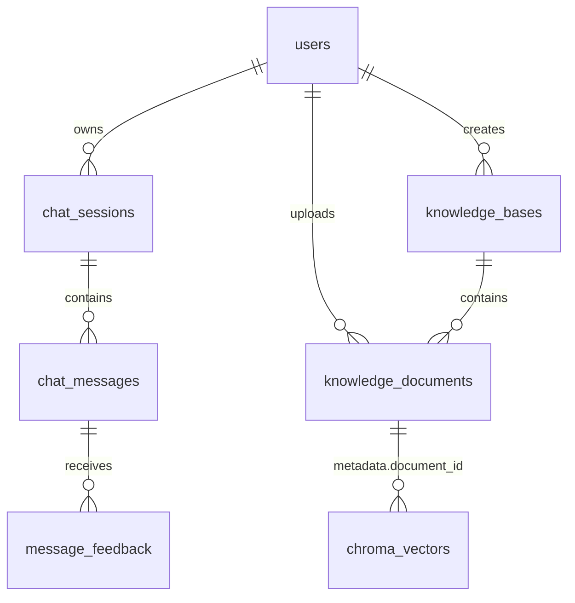
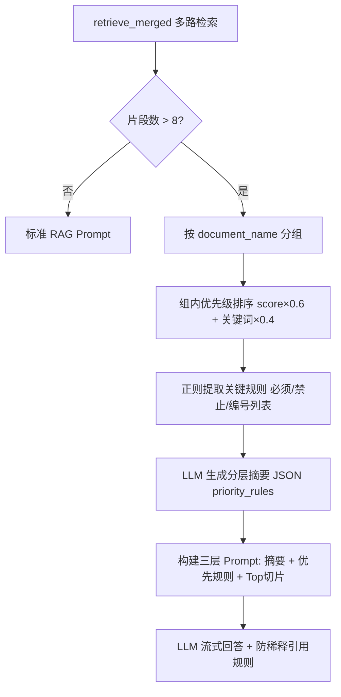
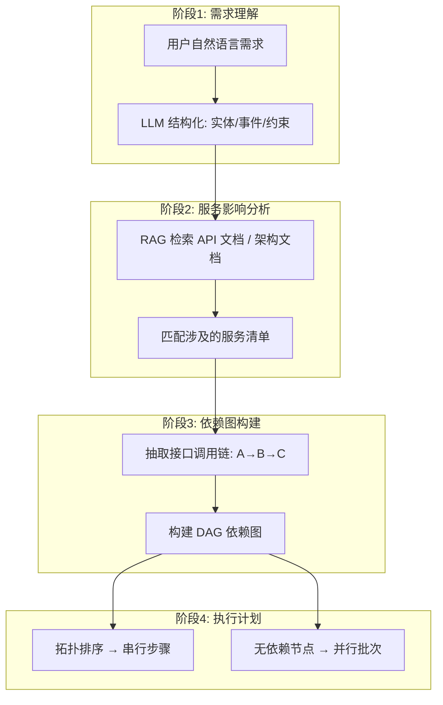
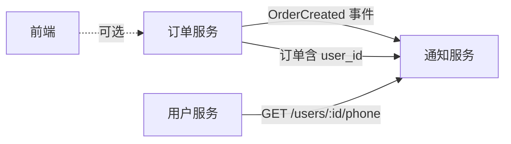

# HaiChiAgent 面试问答：RAG 工程与 Agent 设计

> **用途**：HaiCi 笔试 / 技术面试口述准备  
> **项目**：HaiChiAgent 智能客服 RAG 系统  
> **更新**：2026-06-16  
> **说明**：本文结合项目真实代码与文档，每条均给出「设计思路 → 代码通路 → 验证方式」。

---

## 目录

- [1. 业务思考：检索为空 / 上下文超长 / LLM 幻觉（重点）](#1-业务思考检索为空--上下文超长--llm-幻觉重点)
- [2. 表结构设计：消息存储与向量元数据关联](#2-表结构设计消息存储与向量元数据关联)
- [3. Prompt 优化：减少幻觉的思路与测试](#3-prompt-优化减少幻觉的思路与测试)
- [4. 知识库增量更新](#4-知识库增量更新)
- [5. 大规模检索下的 LLM 执行保障（防注意力稀释）](#5-大规模检索下的-llm-执行保障防注意力稀释)
- [6. 终极挑战：AI Agent 任务拆解能力](#6-终极挑战ai-agent-任务拆解能力)
- [附录：面试速记](#附录面试速记)

---

## 1. 业务思考：检索为空 / 上下文超长 / LLM 幻觉（重点）

### 总体原则：分层兜底 + 可观测 + 不静默编造

| 问题 | 工程策略 | 代码通路 |
|------|----------|----------|
| **检索为空** | 短路 LLM，返回标准兜底话术 | `chat.py` → `rag.py` |
| **上下文超长** | 字符预算裁剪 + Top-K + 防稀释压缩 | `chat_context.py` + `context_anti_dilution.py` |  摘要+滑动窗口
| **LLM 幻觉** | Prompt 硬约束 + 句末引用 + 空检索不调模型 | `prompt_segments.py` + `rag_slice_utils.py` |

### 1.1 检索为空

**思路**：空上下文时不让 LLM「自由发挥」，直接走兜底分支，并在 SSE 里显式告知前端。

**代码通路**：

1. **相似度过滤**（`backend/app/rag.py`）

```python
def retrieve(query: str, tenant_id: str = "default") -> List[Document]:
    docs = vec_search(query, k=settings.RAG_TOP_K, tenant_id=tenant_id)
    filtered = []
    for d in docs:
        score = float(d.metadata.get("score", 0))
        if score >= settings.RAG_SCORE_THRESHOLD:  # 默认 0.35
            filtered.append(d)
    return filtered
```

2. **Chroma 不可用降级**（`safe_retrieve_merged`）：捕获异常，返回 `[]` 并打降级日志，不阻断主流程。

3. **空检索短路 LLM**（`backend/app/routers/chat.py`）

```python
elif not docs:
    fallback = settings.FALLBACK_NO_CONTEXT
    parts.append(fallback)
    async for evt in _emit_simulated_stream(fallback):
        await emit(evt)
```

- **关键设计**：`not docs` 时不调用 `build_prompt_messages`，避免模型用预训练知识「补全」答案。
- 兜底话术可在管理后台通过 `POST /api/v1/settings/fallback` 配置（`config.py` 中 `FALLBACK_NO_CONTEXT`）。
- 业务流程文档（`docs/业务流程说明.md`）明确：知识库检索为空 → 返回 `FALLBACK_NO_CONTEXT`，不编造答案。

**面试话术**：「我们把空检索当成一等公民分支，而不是 RAG 失败的边缘情况；产品侧可配置话术，工程侧保证零幻觉来源。」

### 1.2 上下文超长

**思路**：多轮历史、RAG 片段、System Prompt 分别设预算，从外到内裁剪。

**代码通路**：

1. **历史字符预算**（`backend/app/services/chat_context.py`）

```python
def history_char_budget() -> int:
    reserve = max(0, int(settings.CHAT_CONTEXT_RESERVE_CHARS))   # 默认 32768
    total = max(0, int(settings.CHAT_MAX_CONTEXT_CHARS))         # 默认 256K
    return max(1024, total - reserve)
```

2. **`select_history_messages`**：从最新消息向前累加，超出预算则截断更早轮次；同时受 `CHAT_HISTORY_TURNS`（默认 50 轮）限制。

3. **RAG 侧压缩**：
   - `retrieve_merged` 最多返回 `RAG_TOP_K` 条（默认 3，可配置）。
   - `normalize_rag_slices` 默认 `max_slices=8`。
   - 片段数 > 8 时触发 **防稀释机制**（见第 5 题）：按文档分组、优先级排序、分层摘要后再喂 LLM。

4. **文档标准化截断**：VLM 处理图片超上限时 `truncated=true`，校验器允许 MD 内 picture 块数大于实际处理数（`doc_asset_validator.py`）。

**面试话术**：「我们不是简单 truncate 全文，而是 history 预算 + RAG Top-K + 防稀释三层压缩，保证关键规则排在 Prompt 前部。」

### 1.3 LLM 幻觉

**思路**：约束来源 + 强制溯源 + 离线评测闭环。

**Prompt 硬约束**（`backend/app/services/prompt_segments.py`）：

| 段变量 | 内容 | 作用 |
|--------|------|------|
| `CNSTR_ONLY_FROM_KB` | 只能依据知识库片段回答，不得编造 | 切断预训练知识来源 |
| `CNSTR_STATE_UNCERTAINTY` | 若资料不足请明确说明无法回答 | 防止强行编造 |
| `CITE_NO_FABRICATION` | 禁止编造未出现在切片中的事实 | 引用格式兜底 |
| `CNSTR_NO_SPECULATION` | 闲聊时不编造产品参数/政策 | 闲聊分支安全网 |

**引用格式防编造**：

- 每句论断句末必须标 `1、2、3` 编号（对应预检索文献 `[n]`）。
- 回答末尾强制输出「文献切片明细 + 注释 + 置信度 0–100」。
- 前端 `ChatAssistantMessage.vue` + `renderMarkdown.ts` 渲染引用上标与折叠面板。

**评测验证**（`backend/app/services/rag_eval_service.py`）：

| 指标 | 说明 |
|------|------|
| **Faithfulness** | 答案 embedding 与检索片段 cos_sim 均值 |
| **Groundedness** | 拆成原子断言，逐条与片段比对，低于 0.65 标记潜在幻觉 |
| **Factual Consistency** | LLM-as-Judge 二次校验 |

**Groundedness 公式**：

> 将回答拆为原子断言 → 每断言与检索片段计算最高 cos_sim → 低于 0.65 标记为潜在幻觉

**面试话术**：「防幻觉是 Prompt 约束 + 空检索短路 + 引用溯源 UI + 三层评测指标的组合拳，不是单靠一句 system prompt。」

---

## 2. 表结构设计：消息存储与向量元数据关联

### 设计原则

**MySQL 管业务态，Chroma 管检索态，通过 `document_id` + `tenant_id` 桥接。**

### ER 关系概览



### 消息存储（MySQL）

| 表 | 关键字段 | 作用 |
|----|----------|------|
| `chat_sessions` | `context_id`(UUID)、`meta_json` | 跨链路追踪、会话元数据（message_count / last_intent / pinned） |
| `chat_messages` | `role`、`content`、`intent_label`、`citations_json` | 持久化问答 + **引用快照** |
| `message_feedback` | `rating`、`intent_liked`、`context_snapshot_json` | 满意度与意图纠偏闭环 |

**`ChatMessage` 模型**（`backend/app/models.py`）：

```python
class ChatMessage(Base):
    __tablename__ = "chat_messages"
    session_id: Mapped[int] = ...          # FK → chat_sessions
    role: Mapped[str] = ...                # user / assistant / system
    content: Mapped[str] = mapped_column(Text)
    intent_label: Mapped[str | None] = ...
    citations_json: Mapped[dict | list | None] = mapped_column(JSON)
```

- `citations_json` 存当次 SSE 下发的完整文献切片，**与 Chroma 解耦**：即使向量库后续变更，历史回答仍可溯源。

### 向量元数据（Chroma）

| 字段 | 来源 | 作用 |
|------|------|------|
| `document_id` | MySQL `knowledge_documents.id` | 按文档增量删/更新 |
| `document_name` | 原始文件名 | 引用展示、防稀释分组 |
| `chunk_index` | 分块序号 | 定位切片 |
| `tenant_id` | `user_id` 或 `kb_id` | 多租户/多库隔离 |
| `score` | 检索时写入 | 相似度排序 |

**分块写入 metadata**（`backend/app/services/kb_chunk_service.py`）：

```python
Document(
    page_content=p.text,
    metadata={
        "document_id": document_id,
        "document_name": document_name,
        "chunk_index": p.index,
        "slice_mode": ...,
    },
)
```

**Chroma ID 规则**（`backend/app/vectorstore.py`）：

```python
doc_id = f"{tenant_id}_{doc_hash(doc.page_content)}"  # MD5 内容哈希
```

### 关联链路

```text
上传文档 → MySQL knowledge_documents(id=27)
         → split_to_documents(document_id=27)
         → Chroma.add(ids=tenant_id_md5hash, metadata={document_id: 27})
问答检索 → Chroma.search(tenant_id) → Document.metadata.document_id
         → citations_json 写入 chat_messages
```

**面试话术**：「关系库存文档生命周期和引用快照，向量库只存可检索分块；两者通过 document_id 关联，删除文档时按 metadata 精确清理向量，不影响其他文档。」

---

## 3. Prompt 优化：减少幻觉的思路与测试

### 3.1 优化思路（模块化段式 Prompt）

项目将 Prompt 收敛到 `backend/app/services/prompt_segments.py`，按语义分段：

| 段类型 | 示例 | 防幻觉作用 |
|--------|------|------------|
| `ROLE_*` | 企业客服身份 | 限缩行为边界 |
| `CNSTR_*` | 只依据 KB、不足则声明 | 切断预训练知识来源 |
| `CITE_*` | 句末编号 + 切片明细 + 置信度 | 强制可验证输出 |
| `PIC_*` | 禁止输出 description 原文 | 防止 VLM 元数据污染回答 |
| `ANTI_DILUTION_*` | 优先规则列表、禁止混淆不同文档规则 | 多文档场景防规则串台 |
| `PREPROC_*` | 意图/改写/关键词 JSON | 提升检索召回，减少答非所问 |

**RAG 核心规则组合**（`RAG_CORE_RULES`）：

```text
你是企业智能客服。只能依据知识库片段回答，不得编造。
若资料不足请明确说明无法回答。
```

**组装函数**：

- `build_rag_system_prompt(cite_instruction)` — RAG 回答 system prompt
- `build_citation_format_block()` — 完整引用格式指令
- `build_anti_dilution_cite_instruction()` — 防稀释专用引用规则

### 3.2 Agent 配置治理

**`agent_prompt_registry.py`**：

- 每个 Agent 的 `AGENT.md` 标注「误改后果」，例如：
  - 去掉「不要编造菜单」→ 幻觉菜单项污染知识库
  - 允许「推测趋势」→ 无依据的数字幻觉
- 前端 `AgentConfigPanel.vue` 可编辑 Prompt，保存到 `backend/data/agent_config.json`，**需重启后端生效**。

### 3.3 优化迭代路径

1. **基线**：`RAG_CORE_RULES`（身份 + 知识隔离 + 不确定性声明）。
2. **溯源增强**：加入 `CITE_*` 全套引用格式 → 前端文献折叠面板。
3. **多文档增强**：`ANTI_DILUTION_PRIORITY_RULES` → 优先规则 + 冲突透明化。
4. **VLM 入库增强**：各 `image_describe_*_agent` 的「只描述可见内容、不得编造」约束。

### 3.4 测试过程

| 层次 | 手段 | 文件/模块 |
|------|------|-----------|
| 单元测试 | 防稀释分组/排序/规则提取/阈值触发 | `backend/tests/test_regression_anti_dilution.py` |
| 集成测试 | 上传文档 → SSE 问答 → 检查 citations | `scripts/rag_import_and_test.py` |
| 离线评测 | Faithfulness / Groundedness / nDCG / MRR | `rag_eval_service.py` + EvalDashboard |
| 线上反馈 | 1–5 星 + 意图纠偏 + context_snapshot | `message_feedback` 表 + FeedbackAdminPanel |
| 文档资产校验 | 标准化 MD 与 manifest 一致性 | `test_doc_asset_validator.py` |

**面试话术**：「Prompt 不是一坨字符串，而是可版本化、可审计的段式变量；每次改动都有对应评测指标和用户反馈闭环验证。」

---

## 4. 知识库增量更新

### 设计：按文档粒度读写，新增不影响已有向量

### 入库（只增本 doc 的 chunk）

**`vectorstore.add_documents`**：

```python
all_ids = [f"{tenant_id}_{doc_hash(doc.page_content)}" for doc in docs]
# 跳过已存在的 ID
for doc in docs:
    doc_id = f"{tenant_id}_{doc_hash(doc.page_content)}"
    if doc_id not in existing_ids and doc_id not in new_ids:
        new_docs.append(doc)
collection.add(ids=new_ids, embeddings=embeddings, documents=texts, metadatas=metadatas)
```

- ID = `tenant_id + MD5(chunk内容)` → **内容去重**，重复 chunk 不重复写入。
- 新文档分配新 `document_id`，与已有向量完全隔离。

### 删除（只删本 doc）

**`vectorstore.delete_by_document`**：

```python
collection.delete(where={"$and": [{"tenant_id": tid}, {"document_id": doc_id_val}]})
```

- Chroma 不可用时跳过向量清理，**不阻断 MySQL 侧删除**。

### 上传完整流程

**`backend/app/routers/knowledge.py` → `ingest_uploaded_document`**：

```text
1. MySQL 插入 knowledge_documents(status=processing)
2. inspect → normalize（可选 VLM/OCR）→ chunk → vectorize
3. add_documents(chunks, tenant_id)
4. 更新 chunk_count、status=ready
5. 失败则 status=failed，不污染已有向量
```

### 多库隔离

- `tenant_id` 可为 `user_id` 或 `kb_id`（`chat.py` 中按知识库路由）。
- 不同库的向量在同一 Chroma collection（`kb_main`）内通过 metadata 隔离。

**面试话术**：「增量更新的核心是 document_id 粒度的 add/delete，加上 content-hash 去重；MySQL 是 source of truth，Chroma 是可重建的检索索引。」

---

## 5. 大规模检索下的 LLM 执行保障（防注意力稀释）

### 背景（PRD 加分项 5）

在企业级场景中，知识库文档非常多时，检索返回的相关片段和业务规则可能有数十条甚至更多。需确保 LLM：

1. 不会因「注意力稀释」而遗漏某条关键规则；
2. 不会在信息过载时产生幻觉（编造不存在的规则或混淆不同规则）。

### 已实现模块

**`backend/app/services/context_anti_dilution.py`**

**触发条件**：检索片段数 > `ANTI_DILUTION_THRESHOLD`（默认 8，可通过 `ANTI_DILUTION_ENABLED` 开关）

### 四步策略



### 核心函数

| 函数 | 作用 |
|------|------|
| `_group_docs_by_source` | 按 `document_name` 分组 |
| `_rank_docs_by_priority` | 相似度 0.6 + 关键词命中 0.4 加权排序 |
| `_extract_key_rules` | 正则提取编号列表、禁止/必须类规则 |
| `_build_layered_summary` | 文档级摘要 + Top-N 片段 + 关键规则 |
| `_generate_layer_summary_with_llm` | LLM 输出 JSON：summary / priority_rules / confidence |
| `apply_anti_dilution` | 入口：超阈值触发，返回压缩后 docs + llm_summary |
| `build_anti_dilution_prompt_messages` | 组装含分层摘要的 Prompt |

**配置项**（`backend/app/config.py`）：

```python
ANTI_DILUTION_ENABLED: bool = True
ANTI_DILUTION_THRESHOLD: int = 8
ANTI_DILUTION_MAX_GROUPS: int = 5
```

### 防幻觉专项规则（多文档场景）

```text
1. 优先引用上述「优先规则」列表中的条款
2. 若多个文档存在冲突规则，明确指出差异并建议以最新/最权威的文档为准
3. 每一步推断必须对应一个具体的切片编号
4. 不要合并或混淆来自不同文档的规则
```

### 降级策略

- LLM 分层摘要失败 → 用正则提取的规则构造 fallback JSON（confidence=60）。
- 防稀释整体失败 → 降级为原始排序结果，不阻塞主流程（见 `docs/业务流程说明.md`）。

### 调用链路

```text
chat.py
  → safe_retrieve_merged(rag_query, tenant_id)
    → retrieve_merged (多 query 合并去重)
    → apply_anti_dilution (若启用且超阈值)
  → build_prompt_messages(..., anti_dilution_summary)
  → SSE meta.anti_dilution = true/false
```

### 效果验证

| 方式 | 内容 |
|------|------|
| 单元测试 | `test_regression_anti_dilution.py`：分组、排序、规则提取、阈值触发 |
| 运行时标记 | SSE `meta.anti_dilution=true` |
| 评测看板 | `rag_eval_service` 管道节点含「防稀释」 |
| 日志埋点 | `agent_call_logger.log_rag_conversation(anti_dilution=...)` |
| 对比实验 | 关闭 vs 开启 `ANTI_DILUTION_ENABLED`，对比 Groundedness 与漏规则率 |

**面试话术**：「大量上下文的问题不是塞更多 token，而是先压缩成『优先规则 + 分层摘要』，再保留 Top 切片供精确引用；LLM 摘要失败有规则级 fallback。」

---

## 6. 终极挑战：AI Agent 任务拆解能力

> **项目现状**：`docs/SPEC-AI问答Agent.md` §4 明确标注「Agent 跨微服务任务拆解 → 仅占位，未完整实现」。以下给出**可落地的设计思路**，并说明如何复用现有 Pipeline 架构扩展。

### 6.1 问题定义

在真实研发团队中，一个用户需求往往需要同时改动多个微服务（前端、用户服务、订单服务、通知服务等）。Agent 收到需求（如「用户下单后自动发送短信通知」和全套技术文档/接口文档后，需准确判断：

- 需要改哪几个微服务？
- 哪些改动可以同时进行（互不影响）？
- 哪些改动必须按先后顺序来（有依赖关系）？

### 6.2 拆解框架（四阶段）


深度排序呗说白了

### 6.3 示例：「用户下单后自动发送短信通知」

#### Step 1 — 需求结构化（LLM JSON 输出）

```json
{
  "trigger": "order.created",
  "actions": ["send_sms"],
  "entities": ["user", "order", "phone"],
  "constraints": ["下单成功后", "短信模板需审核"]
}
```

#### Step 2 — RAG 检索技术文档，识别涉及服务

| 服务 | 改动点 | 依据 |
|------|--------|------|
| **订单服务** | 下单成功后发布 `OrderCreated` 事件 | 订单 API 文档 |
| **通知服务** | 订阅事件、调用短信网关 | 通知服务 README |
| **用户服务** | 提供手机号查询接口（若订单不含 phone） | 用户 API 文档 |
| **前端** | 可选：订单详情页展示「已发送通知」状态 | 产品需求 |

#### Step 3 — 依赖 DAG



#### Step 4 — 执行计划

| 批次 | 可并行 | 任务 | 原因 |
|------|--------|------|------|
| **Batch 1** | ✅ 并行 | 用户服务：确认 phone 字段接口；通知服务：定义短信模板 | 无交叉依赖 |
| **Batch 2** | ❌ 串行 | 订单服务：下单流程末尾发布 `OrderCreated` 事件 | 通知服务需先有事件契约 |
| **Batch 3** | ❌ 串行 | 通知服务：实现事件消费 + 短信发送 | 依赖 Batch 2 的事件 |
| **Batch 4** | ✅ 可选 | 前端：展示通知状态 | 依赖 Batch 3 的通知记录 API |

### 6.4 如何接入现有 HaiChiAgent 架构

可在 `backend/app/services/agent_pipeline.py` 后新增节点：

```text
run_agent_pipeline()
  → [现有] 意图识别 → Query 改写 → 关键词 → 术语映射
  → [新增] decompose_requirement()     # LLM 输出服务清单 + DAG
  → [新增] plan_execution_batches()    # 拓扑排序 → parallel_groups[]
  → [输出] SSE task_plan 事件          # 前端展示拆解结果
```

**可复用组件**：

| 现有模块 | 复用方式 |
|----------|----------|
| `prompt_segments.py` | 新建 `TASK_DECOMPOSE_*` 段式 Prompt |
| `safe_retrieve_merged` | 检索 API 文档/架构文档作为拆解依据 |
| `context_anti_dilution` | 多服务文档场景防规则遗漏 |
| `ops_agent` | 失败链路诊断与重试建议 |
| `agent_call_logger` | 拆解过程全链路 trace |
| `image_describe_api_diagram_agent` | 解析接口链路图文档 |

### 6.5 LLM 输出 Schema 建议

```json
{
  "services": [
    {
      "name": "order-service",
      "changes": ["发布 OrderCreated 事件"],
      "depends_on": []
    },
    {
      "name": "notify-service",
      "changes": ["订阅事件", "发短信"],
      "depends_on": ["order-service"]
    }
  ],
  "parallel_groups": [
    ["user-service", "notify-service-template"],
    ["order-service"],
    ["notify-service-consumer"],
    ["frontend"]
  ],
  "risks": ["事件幂等", "短信频率限制"]
}
```

### 6.6 验证方式（即使不实现完整代码）

1. **黄金用例集**：10 条典型需求（下单通知、登录改密、库存扣减…），人工标注标准拆解，对比 Agent 输出。
2. **依赖正确率**：DAG 边是否与 API 文档中的调用关系一致。
3. **并行安全率**：并行批次内服务是否 truly independent（无共享 DB 写、无接口契约未定义）。
4. **回归门禁**：拆解结果必须引用文档切片编号，禁止无依据添加服务。

**面试话术**：「任务拆解本质是『需求结构化 + 文档 RAG + 依赖图拓扑排序』；我们已有 Pipeline 节点化、防稀释、Prompt 段式管理，扩展一个 decompose 节点即可，不需要上 LangGraph。」

---

## 附录：面试速记

| # | 一句话总结 |
|---|-----------|
| 1 | 空检索短路 LLM + 字符预算裁剪 + Prompt 溯源约束 + 三层评测 |
| 2 | MySQL 存消息/文档生命周期，Chroma 存分块，`document_id` 桥接，`citations_json` 快照溯源 |
| 3 | 段式 Prompt 模块化 + 引用格式强制 + Agent 误改风险文档 + Eval/反馈闭环 |
| 4 | 按 `document_id` 增量 add/delete，content-hash 去重，MySQL 为真源 |
| 5 | 超 8 片段触发分组→排序→规则提取→LLM 摘要→优先规则 Prompt，有单测和 SSE 标记 |
| 6 | 需求结构化→文档 RAG 定服务→DAG 拓扑排序→并行/串行批次；可扩展 agent_pipeline |

### 关键代码文件索引

| 模块 | 路径 |
|------|------|
| 对话编排 / SSE | `backend/app/routers/chat.py` |
| RAG 检索 | `backend/app/rag.py` |
| 向量库 | `backend/app/vectorstore.py` |
| 防稀释 | `backend/app/services/context_anti_dilution.py` |
| Prompt 段式管理 | `backend/app/services/prompt_segments.py` |
| 引用块构建 | `backend/app/services/rag_slice_utils.py` |
| Agent Pipeline | `backend/app/services/agent_pipeline.py` |
| 知识库入库 | `backend/app/services/knowledge_processor.py` |
| 分块服务 | `backend/app/services/kb_chunk_service.py` |
| 上下文预算 | `backend/app/services/chat_context.py` |
| RAG 评测 | `backend/app/services/rag_eval_service.py` |
| 数据模型 | `backend/app/models.py` |
| 配置 | `backend/app/config.py` |

### 相关 SPEC 文档

- `docs/SPEC-AI问答Agent.md` — Pipeline 节点与 PRD 映射
- `docs/SPEC-RAG问答全链路.md` — 端到端 RAG 规格
- `docs/SPEC-RAG文档标准化.md` — 入库与 VLM 标准化
- `docs/数据库设计.md` — 表结构说明
- `docs/业务流程说明.md` — 异常处理与降级策略
- `docs/AI架构设计.md` — 总体架构

---

*本文档由项目代码与 SPEC 整理生成，供面试与技术评审使用。*


==================================================
标记内容汇总
==================================================
COUNT: 39
ORDER_FP: a7f5a83ec41d6d3a
1. [CNT=1] Top-K
2. [CNT=1] 摘要+滑动窗口
3. [CNT=1] 历史字符预算
4. [CNT=1] 则截断更早轮
5. [CNT=1] 默认 50 轮
6. [CNT=1] 片段数 > 8 时
7. [CNT=1] 防稀释机制**（见第 5 题）：按文档分组、优先级排序、分层摘要后再喂 LLM
8. [CNT=1] 处理图片超上限时 `truncated=true`，校验器允许 MD 内 picture 块数大于实际处理数
9. [CNT=1] 离线评测闭环
10. [CNT=1] > 将回答拆为原子断言 → 每断言与检索片段计算最高 cos_sim
11. [CNT=2] 优先规则
12. [CNT=1] 按文档粒度读写
13. [CNT=1] *内容去重**，重复 chunk 不重复写入
14. [CNT=1] 与已有向量完全隔离
15. [CNT=1] 知识库文档非常多
16. [CNT=1] 可能有数十条甚至更多。需确保 LLM
17. [CNT=1] 「注意力稀释」
18. [CNT=1] 遗漏某条关键规则
19. [CNT=1] 信息过载时产生幻觉
20. [CNT=1] 编造不存在的规则或混淆不同规则
21. [CNT=4] 摘要
22. [CNT=3] 优先规则
23. [CNT=1] Top切片
24. [CNT=1] LLM 流式回答 + 防稀释引用规则]
25. [CNT=1] 冲突规则
26. [CNT=1] ，明确指出差异并建议以最新/最权威的文档为
27. [CNT=1] LLM 分层摘要失败
28. [CNT=1] 正则提取的规则构造 fallback JSON
29. [CNT=1] 降级为原始排序结果
30. [CNT=1] 不阻塞主流程
31. [CNT=1] 改动多个微服务
32. [CNT=1] LLM 结构化: 实体/事件/约束
33. [CNT=1] RAG 检索 API 文档 / 架构文档
34. [CNT=1] 匹配涉及的服务清单
35. [CNT=1] 依赖图构建
36. [CNT=1] 抽取接口调用链: A→B→C
37. [CNT=1] 构建 DAG 依赖图
38. [CNT=1] 无依赖节点 → 并行批次
39. [CNT=1] 深度排序呗说白了
==================================================