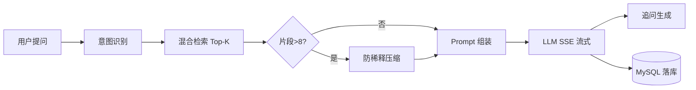

# 项目交付总览

> **项目**：HaiCiAgent — 企业级 RAG 智能知识问答平台  
> **版本**：2026-06-16  
> **定位**：面向 IT 运维与业务支持场景，提供可审计、可溯源的私有化知识问答服务

---

## 一、建设背景与业务价值

企业一线支持每天面对大量重复咨询：产品功能、操作流程、故障处理、政策条款分散在多份 PDF、Word、Wiki 中。人工检索慢、新人上手难；若直接使用公网大模型，又存在**编造内部规则**的合规风险。

HaiCiAgent 的建设目标是：

1. **降本**：将常见咨询转为自助问答，释放支持人力
2. **增效**：秒级检索 + 流式回答，缩短 MTTR（平均解决时间）
3. **合规**：回答必须附带知识库引用，空检索明确告知而非臆造
4. **可运营**：会话留存、反馈统计、趋势分析，驱动知识库持续迭代

---

## 二、技术选型与架构决策

| 层级 | 选择 | 决策理由 |
|------|------|----------|
| 后端 | FastAPI | 原生 async + SSE，适合长连接流式对话 |
| 前端 | Vue 3 + TS | 组件化、类型安全，便于 SSE 事件解析 |
| 关系库 | MySQL 8 | 会话、消息、权限、审计日志强一致存储 |
| 向量库 | Chroma HTTP | 轻量部署，docker compose 一键启动 |
| LLM | OpenAI 兼容 API | 统一网关，支持多厂商切换 |
| Embedding | bge-small-zh-v1.5 | 中文语义检索，CPU 即可运行 |
| RAG 实现 | 自研 Pipeline | 检索/Prompt/流式/落库全链路可控、可观测 |

完整架构见 [AI架构设计.md](./AI架构设计.md)。

---

## 三、核心业务能力链路

**设计原则**：

- **空检索 = 一等公民分支**：不调 LLM，返回可配置兜底话术，杜绝编造
- **引用必须可回溯**：SSE 推送 `citations`，前端展示文档名 + 片段摘要
- **流式必须真实 token**：全部来自 LLM API，无模板模拟

代码入口：`backend/app/routers/chat.py` → `agent_pipeline.py` / `react_agent.py`

---

## 四、扩展能力

| 能力 | 业务价值 | 实现要点 |
|------|----------|----------|
| 意图识别 | 分流产品/售后/投诉，优化 Prompt 与统计 | 规则 + LLM，`chat_messages.intent` 落库 |
| 追问引导 | 降低用户二次提问成本 | 回答后生成 2–3 条建议 |
| 管理后台 | 服务质量可视化 | 反馈聚合、日均问答折线 |
| 多知识库路由 | 多产品线/多部门文档隔离 | auto-route API |
| 防注意力稀释 | 大知识库场景保证关键规则不遗漏 | 分组→优先级→分层摘要 |
| ReAct Agent | 复杂问题自主决策是否检索 | RAG 封装为 tool |

---

## 五、AI 工程保障

| 风险 | 策略 | 业务意义 |
|------|------|----------|
| 检索为空 | 短路 LLM，兜底话术 | 合规：不编造未收录内容 |
| 上下文超长 | 历史预算 + Top-K + 防稀释 | 大库场景回答质量稳定 |
| LLM 幻觉 | Prompt 硬约束 + 引用溯源 UI | 每句论断可审计 |

详细说明：[面试问答-RAG与Agent.md](./面试问答-RAG与Agent.md)

---

## 六、质量验证

| 维度 | 结果 |
|------|------|
| 自动化回归 | **159 passed**（见 [回归测试报告](./回归测试报告-2026-06-16.md)） |
| 结构化 QA | [RAG测试文档/rag_qa_testset.json](../RAG测试文档/rag_qa_testset.json) |
| 功能对照 | [PRD功能对照与验收清单.md](./PRD功能对照与验收清单.md) |

---

## 七、文档清单

| # | 文档 | 路径 | 用途 |
|---|------|------|------|
| 1 | 项目说明 | [项目说明.md](../项目说明.md) | 业务价值与技术选型 |
| 2 | 运行指南 | [运行指南.md](../运行指南.md) | 部署启动 |
| 3 | API 文档 | [API文档.md](./API文档.md) | 接口 + SSE 格式 |
| 4 | 数据库设计 | [数据库设计.md](./数据库设计.md) | ER + 表结构 |
| 5 | AI 架构设计 | [AI架构设计.md](./AI架构设计.md) | RAG 流程 + Prompt |
| 6 | 业务流程说明 | [业务流程说明.md](./业务流程说明.md) | 时序图 |
| 7 | 功能对照清单 | [PRD功能对照与验收清单.md](./PRD功能对照与验收清单.md) | 验收矩阵 |
| 8 | 回归测试报告 | [回归测试报告-2026-06-16.md](./回归测试报告-2026-06-16.md) | 测试证据 |
| 9 | 技术问答 | [面试问答-RAG与Agent.md](./面试问答-RAG与Agent.md) | 深度设计说明 |
| 10 | 环境变量 | [.env.example](../.env.example) | 配置模板 |

---

## 八、后续演进方向

1. Cross-Encoder Reranker 提升检索精度
2. FastAPI lifespan 迁移（替代 on_event）
3. 前端 E2E（Playwright）SSE 视觉回归
4. Groundedness 评测指标接入 CI
