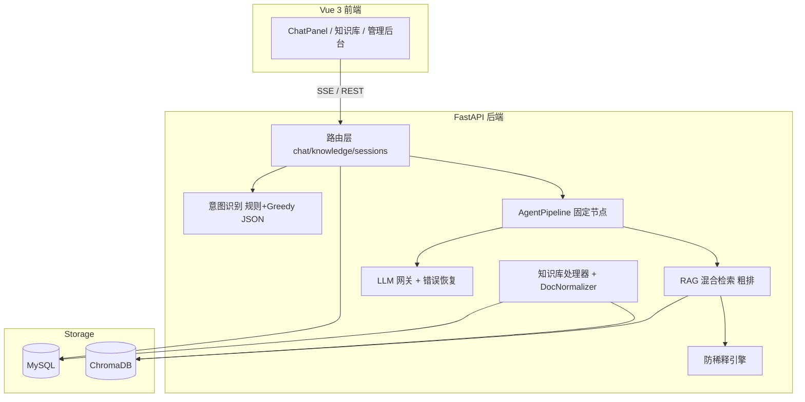
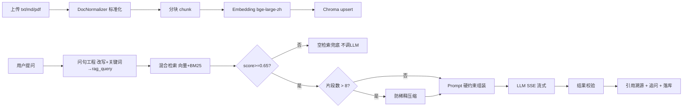

# AI 架构设计

> 业务思考与工程问题处理的完整论述见 [项目说明.md](../项目说明.md) 章节 3；本文档聚焦架构图、RAG 链路与模块映射。

## 1 总体架构（2026-06 交付版）

## 2 RAG 完整流程

**结果校验（V）**：安全/脱敏 → 规则约束 → 事实一致性信号（Faithfulness/Groundedness）→ 低置信度时二次选库 / follow_ups / 意图纠偏。

### 2.1 步骤说明

1. **文档入库**：`knowledge_processor.py` → `doc_normalizer.py` → 分块 → Embedding → Chroma；`doc_asset_validator.py` 四者校验（脱脏）
2. **问句工程**：`agent_pipeline.py` 意图识别 → 问句改写 → 关键词 →（可选）`retrieval_terms` → 组装 `rag_query`
3. **混合检索（粗排）**：`rag.py` + `rag_hybrid_scorer.py`（向量 0.7 + BM25 0.3）→ `rag_gradient_filter.py` 梯度落档 + **0.65 底线**；低分由 `kb_router.py` 二次选库
4. **Prompt 组装**：`prompt_segments.py` 硬约束 + 编号引用块 + 历史裁剪
5. **流式生成**：`llms.py` OpenAI 兼容 stream → SSE `event:token`
6. **结果校验与收尾**：citations 溯源 + `follow_up.py` 追问 + `rag_eval_service.py` 评测指标；低分可走 `intent_suggest.py` 纠偏

## 3 意图识别

**规则快路径 + Greedy JSON 精修**（闲聊极窄定义，业务问一律走 RAG）：

| 意图 code | 规则信号（节选） | 中文标签 |
|-----------|------------------|----------|
| `product_consult` | 产品、功能、介绍 | 产品介绍 |
| `after_sale` | 退货、换货、保修 | 售后问题 |
| `complaint` | 投诉、差评 | 投诉 |
| `chitchat` | 纯寒暄/致谢；**须无**业务技术信号 | 闲聊 |

`_coerce_intent()`：LLM 仍输出 `chitchat` 但含业务词 → 硬纠正为 `product_consult`。

结果通过 SSE `meta.intent` 返回，持久化至 `chat_messages.intent`。

## 4 Prompt 模板设计

System Prompt 由 `prompt_segments.py` 模块化拼接：

| 段 | 作用 |
|----|------|
| `CNSTR_ONLY_FROM_KB` | 仅依据知识库回答 |
| `CNSTR_STATE_UNCERTAINTY` | 资料不足时明确说明 |
| `CITE_NO_FABRICATION` | 禁止编造引用 |
| RAG 上下文块 | `[1] 文档名: 片段...` 编号格式 |
| 历史消息 | 最近 N 轮 user/assistant |

用户问题置于 messages 末尾，检索片段在 system 与 history 之间，保证「规则在前、证据居中、问题在后」。

## 5 向量检索策略

| 参数 | 默认值 | 说明 |
|------|--------|------|
| `RAG_TOP_K` | 3 | 梯度落档下限 |
| `RAG_SCORE_THRESHOLD` | **0.65** | 粗筛最低相似度 + 尾部截断（`score = 1 - distance`） |
| `RAG_HIGH_SCORE_THRESHOLD` | **0.65** | 高质量簇判定，顶格落档 10/8 条 |
| `RAG_COARSE_POOL_K` | 100 | 向量粗召回上限 |
| 混合权重 | vec **0.7** + BM25 **0.3** | `rag_hybrid_scorer.py` |

**得分含义（Chroma + BGE-large-zh）**

- `similarity = 1 - distance`（0~1，越大越相关）
- FAQ/手册类问句的相关片段常见 **0.65~0.85**；**0.35~0.64** 多为弱相关或噪声
- 本项目经抽检**固定 0.65** 为相关下限（非 Cross-Encoder 精排）

## 6 防注意力稀释

当检索片段 > 8：

1. 按 `document_id` 分组，最多 5 组
2. 组内按 `score×0.6 + keyword×0.4` 排序
3. 抽取「必须/禁止/编号」类规则句
4. LLM 生成分层摘要 → 压缩上下文
5. 失败时降级为原始 Top 排序，不阻塞主链路

代码：`context_anti_dilution.py`

## 7 关键设计决策

| 决策 | 选型 | 理由 |
|------|------|------|
| 向量库 | Chroma HTTP | 适合前期中小量产品快速验证，Docker 一键部署 |
| 检索策略 | 向量 + BM25 混合粗排 + 梯度落档 | 无 GPU Reranker 下的轻量增强；**不叫精排** |
| 会话记忆 | SessionContextManager + MySQL | 短期滑动窗口 + 长期持久化 |
| LLM | DeepSeek-V4-flash（火山方舟 ARK） | 回复快、推理强；OpenAI 兼容网关 |
| Embedding | bge-large-zh-v1.5 本地快照 | 中文检索为主，本地缓存无 GPU |
| 流式 | SSE | 真实 LLM token，无模板模拟 |
| 空检索 | 短路不调 LLM | 防幻觉第一原则 |

## 8 异常处理

| 场景 | 行为 | 模块 |
|------|------|------|
| LLM 超时/限流 | 重试 + 友好错误 SSE | `llm_error_recovery.py` |
| Chroma 不可用 | 降级空检索 → 兜底话术 | `rag.py` `safe_retrieve_merged` |
| 防稀释 LLM 失败 | 用原始片段排序 | `context_anti_dilution.py` |
| Embedding 未加载 | 日志告警，词面匹配部分可用 | `vectorstore.py` |
| 预处理 JSON 失败 | 规则改写 + 关键词，不阻塞主链路 | `agent_pipeline.py`、`structured_json.py` |

## 9 AI 工程问题处理

与 [项目说明.md](../项目说明.md) 章节 3 一致。摘要如下：

### 9.1 PRD 核心三类问题（重点）

| 问题 | 策略 | 业务意义 |
|------|------|----------|
| **检索为空** | 不调大模型，返回可配置兜底话术；低分触发知识库二次路由 | 避免编造政策，满足合规要求 |
| **上下文超长** | 会话任务小粒度 + 短期记忆（防稀释摘要、滑动窗口）+ 长期记忆（MySQL 持久化）+ 检索渐进加载 + 重要信息文末加载 | 大知识库场景下仍保证关键规则不被遗漏 |
| **大模型幻觉** | 检索层：问句工程 + 阈值 0.65；生成层：提示词硬约束 + 引用溯源；结果校验：忠实度/扎根度评测 + 低分时追问建议 / 意图纠偏 | 每句论断可回溯；低忠实度可观测、可迭代 |

#### 9.1.1 检索为空

- 粗召回仅保留 `score>=0.65`；全流程无达标片段 → `chat.py` 短路，**不调用大模型**
- 多库场景首轮不足 → `kb_router.py` 二次选库重检

#### 9.1.2 上下文超长

- 粗池 ≤100 → 梯度落档 10/8/5/3；片段 >8 → 防稀释摘要
- `session_context_manager.py` 滑动窗口 + 滚动摘要；全量消息 MySQL 持久化

#### 9.1.3 大模型幻觉

- **问句工程**：`original_query` → `rewritten_query` + `query_keywords` + `retrieval_terms` → `rag_query`
- **生成层**：`prompt_segments.py` 硬约束 + `[1][2]` 引用编号 + SSE `citations`
- **结果校验**：Faithfulness ≥0.65、Groundedness ≥0.70、Factual Consistency ≥0.75；低分 → `follow_up.py` / `intent_suggest.py`

### 9.2 配套工程能力（概要）

| 问题 | 模块 |
|------|------|
| 意图误判 / 闲聊过宽 | `intent.py`、`_coerce_intent()` |
| 多知识库选错库 | `kb_router.py` |
| 用户口语 vs 文档术语 | `agent_pipeline.py`（Greedy JSON `retrieval_terms`） |
| 结构化 JSON 格式固化 | `structured_json.py` |
| 成本与滥用 | `rate_limit.py`、`chat_faq.py` |

详见 [项目说明.md](../项目说明.md) 章节 3.2。

## 10 结果校验（生成后）

| 环节 | 机制 | 模块 |
|------|------|------|
| 安全 / 脱敏 | PII 正则脱敏、敏感词拦截 | `gateway_security.py`（主链路待接入） |
| 脱脏（入库） | MD 与磁盘/manifest 四者一致 | `doc_asset_validator.py` |
| 规则校验 | 空检索不调 LLM；Prompt 仅依据 KB + 引用格式 | `chat.py`、`prompt_segments.py` |
| 事实一致性 | 在线采集 top_score / citations；离线 Faithfulness≥0.65、Groundedness≥0.70 | `agent_call_logger.py`、`rag_eval_service.py` |
| 低置信度 | kb 二次路由、follow_ups 换问法、intent-alternatives 纠偏 | `kb_router.py`、`follow_up.py`、`intent_suggest.py` |

## 11 模块映射

| 模块 | 路径 |
|------|------|
| 配置 | `backend/app/config.py` |
| LLM 调用 | `backend/app/llms.py` |
| LLM 网关 | `backend/app/services/llm_gateway.py` |
| 意图 | `backend/app/intent.py` |
| RAG 检索 | `backend/app/rag.py` |
| 混合评分 | `backend/app/services/rag_hybrid_scorer.py` |
| 梯度过滤 | `backend/app/services/rag_gradient_filter.py` |
| 防稀释 | `backend/app/services/context_anti_dilution.py` |
| 对话编排 | `backend/app/services/agent_pipeline.py` |
| 结构化 JSON | `backend/app/services/structured_json.py` |
| 会话上下文 | `backend/app/services/session_context_manager.py` |
| Prompt 段 | `backend/app/services/prompt_segments.py` |
| 向量库 | `backend/app/vectorstore.py` |
| 知识库处理 | `backend/app/services/knowledge_processor.py` |
| 文档标准化 | `backend/app/services/doc_normalizer.py` |
| 流式入口 | `backend/app/routers/chat.py` |
