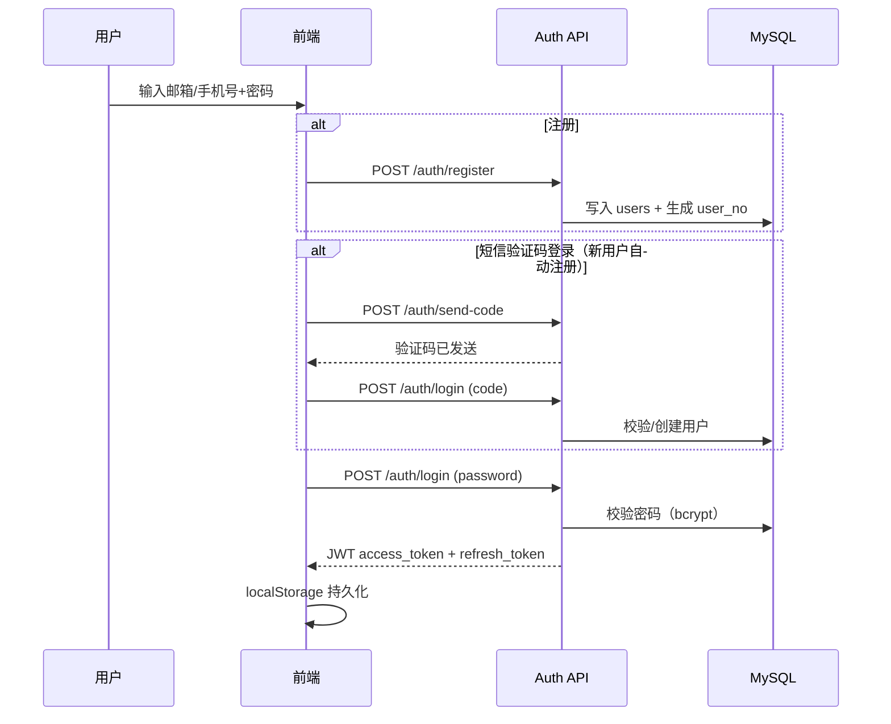
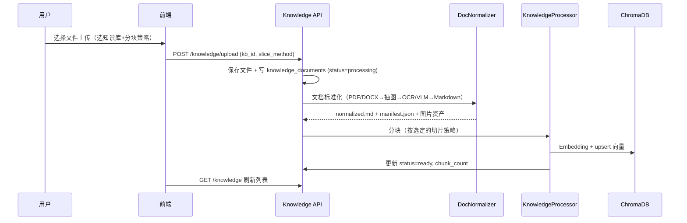
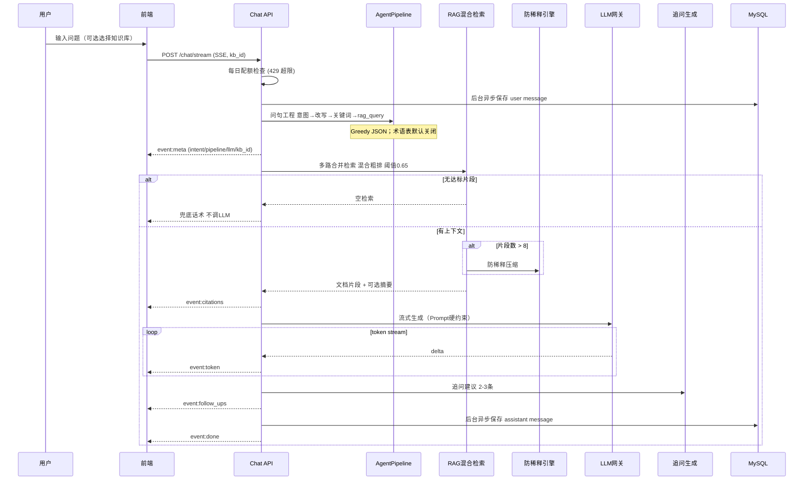
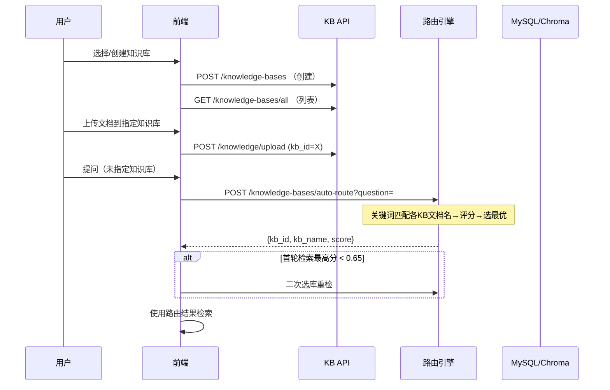
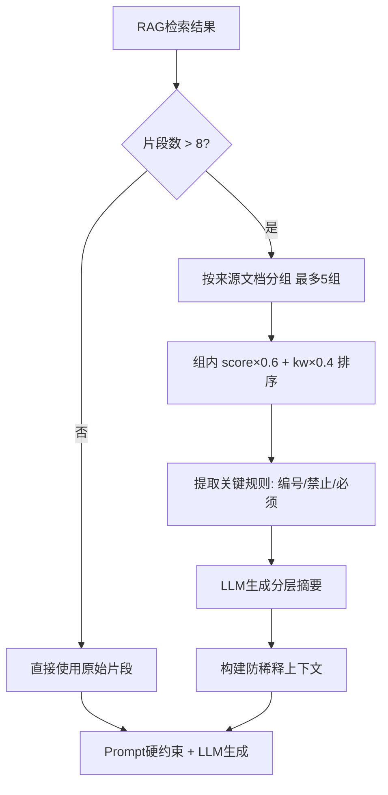
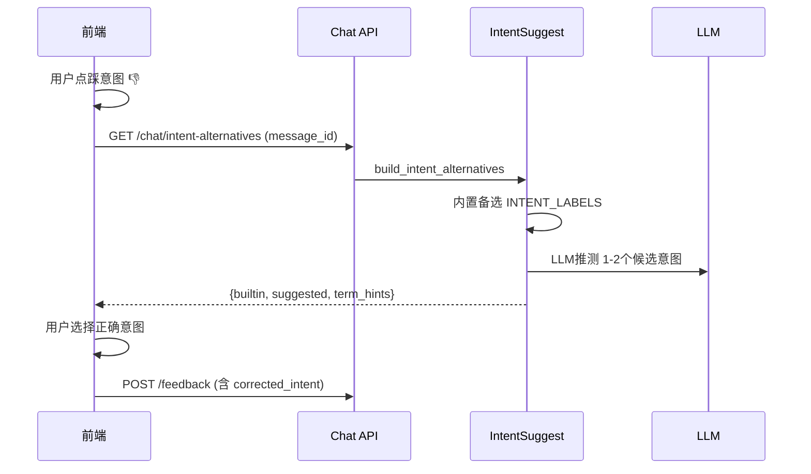

# 业务流程说明

> AI 工程问题与 RAG 链路设计见 [项目说明.md](../项目说明.md) 章节 2、章节 3；本文档聚焦业务时序与交互流程。

## 1 用户注册登录

## 2 知识库上传（含多模态标准化）

## 3 智能问答（SSE 全链路 · 含问句工程与防稀释）

## 4 多知识库路由

## 5 大规模上下文防稀释流程

## 6 意图纠偏流程

## 7 限流策略

- 每用户每日提问上限由 `daily_question_usage` 表统计
- 配置项见 `.env.example` 中 `DAILY_QUESTION_LIMIT`（默认 100）
- 超限返回 HTTP 429
- 单次提问不超过 `MAX_QUESTION_LENGTH`（默认 500 字）
- FAQ 命中直出，不走检索/大模型（`chat_faq.py`）

## 8 异常处理

| 场景 | 行为 |
|------|------|
| LLM API 失败/超时 | SSE 推送错误信息；`llm_error_recovery.py` 截断重试/换节点 |
| 知识库检索为空 | 返回 `FALLBACK_NO_CONTEXT`，**不调用大模型** |
| 向量库不可用 | RAG 降级为空 → 兜底话术，日志可观测 |
| 防稀释 LLM 失败 | 降级为原始排序结果，不阻塞主链路 |
| 预处理 JSON 失败 | 规则改写 + 关键词（`agent_pipeline.py`） |
| 未登录 | 401，前端路由守卫重定向 /login |
| 限流触发 | 429，前端提示次日再试 |
| SSE 连接中断 | 后台继续生成并异步落库 |
| Embedding 未加载 | 日志告警，BM25 词面匹配部分可用 |
