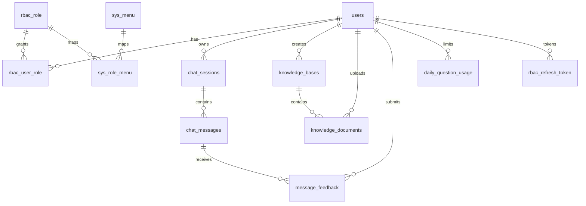

# 数据库设计

> 权威 DDL：`backend/数据库初始化脚本/schema_full_v1.sql`  
> ORM 定义：`backend/app/models.py`（须与 DDL 保持一致）  
> 存量迁移：启动时 `bootstrap.ensure_auth_ready()` 自动补齐列/索引

## 1 命名与类型规范

| 类别 | 规则 | 示例 |
|------|------|------|
| 业务域表 | 复数 `snake_case` | `users`, `chat_sessions`, `knowledge_documents` |
| RBAC / 系统表 | `rbac_*` / `sys_*` + 单数实体（历史兼容，不重命名） | `rbac_role`, `sys_menu` |
| 日志表 | `sys_log_*`，主键 **`log_id`** | `sys_log_operation` |
| 主键（业务表） | `id BIGINT AUTO_INCREMENT` | — |
| 状态 / 布尔 | `TINYINT NOT NULL`，**1=是/启用，0=否/禁用** | `status`, `enabled`, `user_deleted` |
| 时间戳 | `created_at DATETIME NOT NULL DEFAULT CURRENT_TIMESTAMP`；可变表加 `updated_at ON UPDATE` | — |
| 软删除 | 用户侧：`user_deleted` + `user_deleted_at`；`status` 仅表示归档 | `chat_sessions` |
| **表间关联** | **禁止数据库 FOREIGN KEY**（阿里/MySQL 线上规约）；关联列 `*_id` **仅建索引** | `user_id`, `session_id`, `kb_id` |
| 引用完整性 | **应用层**维护：Service 校验、事务内联删、孤儿数据定时任务 | 见各 router/service |
| 字符集 | `utf8mb4` / `utf8mb4_unicode_ci` | 全库统一 |
| JSON 字段 | 后缀 `_json` | `meta_json`, `citations_json` |

## 2 ER 关系概览

## 3 表清单（20 张，生产库 `haici_cs`）

| 分组 | 表名 | 说明 |
|------|------|------|
| 用户认证 | `users` | 用户账号 |
| | `rbac_role` | 角色 |
| | `rbac_user_role` | 用户-角色 |
| | `rbac_refresh_token` | 刷新令牌 |
| | `rbac_verify_code` | 短信/邮箱验证码 |
| 权限菜单 | `sys_menu` | 菜单与按钮权限 |
| | `sys_role_menu` | 角色-菜单 |
| | `casbin_rule` | Casbin 策略 |
| 对话 | `chat_sessions` | 会话 |
| | `chat_messages` | 消息 |
| | `message_feedback` | 消息反馈 |
| | `chat_faq` | 欢迎区 FAQ 缓存 |
| 知识库 | `knowledge_bases` | 多知识库 |
| | `knowledge_documents` | 文档与向量化状态 |
| 配额 | `daily_question_usage` | 每日提问次数 |
| 日志 | `sys_log_operation` | 操作审计 |
| | `sys_log_error` | 异常日志 |
| | `sys_log_api_call` | LLM/API 调用 |
| | `sys_log_schedule` | 定时任务 |
| | `sys_log_operation_sql` | SQL 追踪 |

## 4 核心表字段

### users

| 字段 | 类型 | 说明 |
|------|------|------|
| id | BIGINT PK | 内部主键 |
| user_no | VARCHAR(32) UK | 对外编号（Hash） |
| username / email / phone | UK 可空 | 登录标识 |
| password_hash | VARCHAR(255) 可空 | bcrypt；短信注册可无密码 |
| nickname, avatar_url | | 展示信息 |
| status | TINYINT | 1=启用 |
| created_at, updated_at | DATETIME | |

### chat_sessions

| 字段 | 类型 | 说明 |
|------|------|------|
| id | BIGINT PK | 会话 ID |
| context_id | VARCHAR(36) UK | 链路 UUID |
| user_id | FK → users | |
| title | VARCHAR(200) | 默认「新对话」 |
| meta_json | JSON | message_count / last_intent / note / pinned |
| status | TINYINT | 1=正常 0=归档 |
| user_deleted | TINYINT | 用户侧软删 |
| user_deleted_at | DATETIME | |
| created_at, updated_at | DATETIME | |

索引：`idx_sessions_user`，`idx_sessions_user_deleted (user_id, user_deleted)`

### chat_messages

| 字段 | 类型 | 说明 |
|------|------|------|
| role | ENUM | user / assistant / system |
| content | TEXT | 正文 |
| intent_label | VARCHAR(32) | 意图 |
| citations_json | JSON | RAG 引用切片（前端折叠面板） |

### message_feedback

| 字段 | 类型 | 说明 |
|------|------|------|
| rating | TINYINT | 1–5 星 |
| intent_liked | TINYINT | 意图是否准确 |
| context_snapshot_json | JSON | 反馈快照 |
| uk_feedback_user_message | UNIQUE | (message_id, user_id) |

### knowledge_bases / knowledge_documents

| 表 | 关键字段 |
|----|----------|
| knowledge_bases | user_id, name, is_default, status |
| knowledge_documents | user_id, **kb_id**（逻辑关联，无 DB 外键）, filename, storage_path, status ENUM, chunk_count |

### 日志表（主键 log_id）

| 表 | 用途 |
|----|------|
| sys_log_operation | HTTP 操作审计，含 operate_desc、trace_id |
| sys_log_error | 异常，含 prog_impl 代码定位 |
| sys_log_api_call | LLM 网关调用耗时与摘要 |
| sys_log_schedule | 定时任务执行记录 |
| sys_log_operation_sql | 按 trace_id 关联 SQL |

## 5 初始化与迁移

| 脚本 | 用途 |
|------|------|
| **schema_full_v1.sql** | 新环境全量建表（推荐） |
| init.sql | 入口说明，指向 schema_full_v1 |
| migrate_rbac_v1.sql | RBAC 历史迁移（bootstrap 已内联） |
| migrate_chat_sessions_v1.sql | 会话字段参考 |
| migrate_chat_sessions_user_deleted_v1.sql | 用户软删参考 |
| migrate_knowledge_base_v1.sql | 多知识库 + kb_id |
| migrate_chat_faq_v1.sql | FAQ 表 |
| migrate_log_sql_v1.sql | SQL 日志表 |
| migrate_schema_normalize_v1.sql | 补索引（不含外键） |
| migrate_drop_db_foreign_keys_v1.sql | 存量库移除外键（可选/ bootstrap 已内联） |

启动时 `ensure_auth_ready()` 顺序：`create_all` → 列补齐 → **移除历史外键** → 索引规范化 → RBAC 种子。

### 应用层引用完整性约定

| 场景 | 应用层处理 |
|------|------------|
| 删用户 | 按需异步清理会话/文档/令牌（无 DB CASCADE） |
| 删会话 | `chat.py` / `sessions` 路由先删 messages 或标记软删 |
| 删知识库 | 文档 `kb_id` 置 NULL 或随业务批量迁移 |
| 写子表 | 插入前校验父 ID 存在（如 session 归属当前 user） |

样例知识库：`backend/数据库初始化脚本/seed_kb/`
