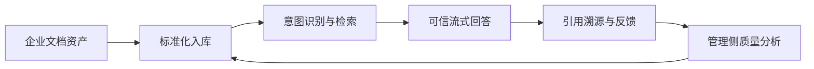
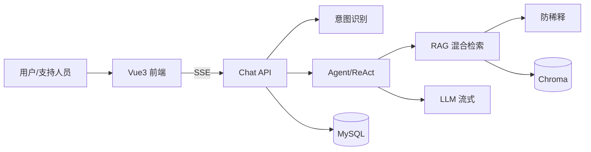

# 项目说明

## 项目概述

HaiCiAgent 是面向企业 IT 运维与业务支持场景的智能知识问答平台。系统将组织内的产品手册、FAQ、流程规范、培训材料等非结构化文档沉淀为可检索的私有知识库，在保障回答**有据可查、可审计溯源**的前提下，降低一线支持对重复性咨询的人工响应成本，并缩短新员工与外包人员的上手周期。

### 解决的核心业务问题

| 痛点 | 业务影响 | HaiCiAgent 的应对 |
|------|----------|-------------------|
| 知识分散、检索困难 | 支持人员反复翻文档，响应慢 | 统一入库、向量化检索，秒级定位相关片段 |
| 回答不可信、难追责 | 通用大模型易编造政策，合规风险高 | 仅依据知识库作答，空检索明确兜底，回答附带文档引用 |
| 多产品线/多文档域 | 问错库、答非所问 | 多知识库隔离与自动路由，按业务域精准召回 |
| 服务质量不可观测 | 无法量化满意度、无法迭代知识 | 会话全量留存、点赞/踩反馈、管理侧统计与趋势分析 |
| 长文档与复杂附件 | PDF/流程图信息丢失 | 文档标准化流水线（抽图、OCR/VLM、结构化 Markdown）后再分块入库 |

### 端到端业务价值链路



从「文档资产沉淀」到「可度量、可迭代的知识服务」，形成闭环：支持人员获得即时、有据的答案；管理者通过会话与反馈数据持续优化知识库与 Prompt 策略。

HaiCiAgent 采用 FastAPI + MySQL + ChromaDB + 云端 LLM 的轻量化架构，**RAG 检索、会话管理、RBAC 权限、多知识库路由、防注意力稀释**等核心能力均为自研实现，面向私有化部署与长期运维设计。

## 业务目标

- 私有知识库智能问答（txt / md / pdf / docx 等）
- 多轮会话持久化，支持历史回溯与审计
- 意图识别、追问引导，提升自助解决率
- 管理后台：全量会话、反馈统计、日均问答趋势
- 多知识库路由与大规模检索下的回答质量保障

## 技术选型

| 层级 | 技术 | 选型理由 |
|------|------|----------|
| 后端 | FastAPI | 原生 async，SSE 流式友好，适合长连接对话 |
| 关系库 | MySQL 8 | 会话、消息、权限、元数据等强一致业务态 |
| 向量库 | ChromaDB HTTP | 轻量部署，docker compose 一键启动 |
| LLM | OpenAI 兼容 API（通义千问等） | 统一 SDK，支持多厂商切换 |
| Embedding | BAAI/bge-small-zh-v1.5（CPU） | 中文语义检索，无 GPU 依赖 |
| 前端 | Vue 3 + TypeScript + Vite | 组件化、类型安全，便于 SSE 事件解析 |

## 整体 AI 架构



详细设计见 [docs/AI架构设计.md](./docs/AI架构设计.md)。

## AI 工程问题处理

| 问题 | 策略 | 业务意义 |
|------|------|----------|
| 检索为空 | 不调 LLM，返回可配置兜底话术 | 避免编造政策，满足合规要求 |
| 上下文超长 | 会话对应任务小粒度（避免上下文过长） +记忆机制：短期记忆-防稀释摘要+滑动窗口，长期记忆：持久化，RAG渐进加载 + 重要信息文底加载 +   | 大知识库场景下仍保证关键规则不被遗漏 |
| LLM 幻觉 |RA Prompt 硬约束 + 引用编号溯源 | 每句论断可回溯至具体文档片段 |

详见 [docs/面试问答-RAG与Agent.md](./docs/面试问答-RAG与Agent.md)。

## 工程实践说明

### 开发辅助工具

| 工具 | 用途 |
|------|------|
| Cursor Agent | 代码生成、重构、测试补全 |
| 通义千问 API | 运行时 LLM 与 Embedding |
| ChatGPT / Claude | 架构讨论、Prompt 迭代 |

### 关键工程修正（RAG 链路）

1. 删除假流式，改为真实 LLM token stream
2. 检索阈值从 0.5 调优至 0.35，平衡召回与精度
3. 向量 metadata 补全 `document_id`，支持精确删向量
4. Chroma 异常时 `safe_retrieve` 降级，不阻断主流程

### 质量验证

- 自动化：`pytest tests/` — **159 passed**（见 [回归测试报告](./docs/回归测试报告-2026-06-16.md)）
- 结构化：[RAG测试文档/rag_qa_testset.json](./RAG测试文档/rag_qa_testset.json)
- 人工：上传培训文档，核对 citations 文档名与片段

## 目录结构

```
├── backend/
│   ├── app/                    # FastAPI 应用
│   ├── 数据库初始化脚本/
│   ├── requirements.txt
│   └── README.md
├── frontend/
│   ├── src/
│   ├── package.json
│   └── README.md
├── docs/
│   ├── API文档.md
│   ├── 数据库设计.md
│   ├── AI架构设计.md
│   ├── 业务流程说明.md
│   ├── PRD功能对照与验收清单.md
│   ├── 回归测试报告-2026-06-16.md
│   └── 项目交付总览.md
├── RAG测试文档/
├── 项目说明.md
├── 运行指南.md
├── docker-compose.yml
└── .env.example
```

## 系统能力概览

| 能力域 | 覆盖范围 |
|--------|----------|
| 用户与会话 | 注册登录、会话 CRUD、消息历史、定时落库 |
| 知识库 | 上传/删除/向量化、多库路由、文档标准化 |
| 智能问答 | SSE 流式、引用溯源、多轮上下文、日配额 |
| 运营分析 | 反馈统计、日均问答趋势、全量会话审计 |
| 高级能力 | 意图识别、追问引导、ReAct Agent、防注意力稀释 |

完整对照：[docs/PRD功能对照与验收清单.md](./docs/PRD功能对照与验收清单.md)

## 相关文档

| 文档 | 链接 |
|------|------|
| 运行指南 | [运行指南.md](./运行指南.md) |
| API 文档 | [docs/API文档.md](./docs/API文档.md) |
| 数据库设计 | [docs/数据库设计.md](./docs/数据库设计.md) |
| AI 架构设计 | [docs/AI架构设计.md](./docs/AI架构设计.md) |
| 业务流程 | [docs/业务流程说明.md](./docs/业务流程说明.md) |
| 项目交付总览 | [docs/项目交付总览.md](./docs/项目交付总览.md) |
| 技术问答 | [docs/面试问答-RAG与Agent.md](./docs/面试问答-RAG与Agent.md) |
