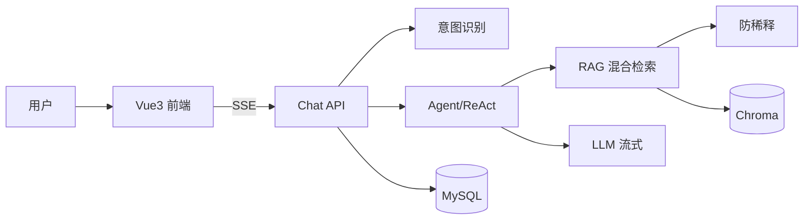

# 项目说明

## 项目概述

HaiChiAgent 是基于 HaiCi 笔试 PRD 构建的企业级 RAG 智能客服系统，实现「用户提问 → 意图识别 → 知识检索 → LLM 流式回答 → 引用溯源 → 反馈闭环」完整 AI 对话链路。

相对上游电商 Agent 仓库做了**减重改造**：移除 Elasticsearch、Redis、本地 vLLM、GPU Reranker 等重型依赖，保留并增强 RAG 核心、SSE 流式、RBAC 管理后台与 PRD 加分项能力。

## 业务目标

- 私有知识库智能问答（txt / md / pdf）
- 多轮会话持久化与历史回溯
- 意图识别、追问引导、用户反馈
- 管理后台：会话审计、反馈统计、日均问答趋势
- 多知识库路由与大规模检索防稀释

## 技术选型

| 层级 | 技术 | 选型理由 |
|------|------|----------|
| 后端 | FastAPI | 原生 async，SSE 流式友好 |
| 关系库 | MySQL 8 | PRD 要求；会话/消息/元数据 |
| 向量库 | ChromaDB HTTP | 轻量部署，docker compose 一键起 |
| LLM | OpenAI 兼容 API（通义千问） | 免费 tier 可用，统一 SDK |
| Embedding | BAAI/bge-small-zh-v1.5（CPU） | 中文场景、无 GPU |
| 前端 | Vue 3 + TypeScript + Vite | PRD 推荐栈之一 |

## 整体 AI 架构



详细设计见 [docs/AI架构设计.md](./docs/AI架构设计.md)。

## AI 工程问题处理（重点）

| 问题 | 策略 |
|------|------|
| 检索为空 | 不调 LLM，返回可配置兜底话术 `FALLBACK_NO_CONTEXT` |
| 上下文超长 | 历史预算截断 + Top-K + 防稀释分层摘要 |
| LLM 幻觉 | Prompt 硬约束 + 引用编号溯源 + 空检索短路 |

详见 [docs/面试问答-RAG与Agent.md](./docs/面试问答-RAG与Agent.md)。

## 使用 AI 编程工具的说明（PRD 要求）

### 使用的工具

| 工具 | 用途 |
|------|------|
| Cursor Agent / Composer | 代码生成、重构、测试补全 |
| 通义千问 API | 运行时 LLM 与 Embedding |
| ChatGPT / Claude | 架构讨论、Prompt 迭代 |

### 对 AI 生成代码的关键修正

1. **删除假流式**：初版 sleep 切片 → 改为真实 LLM token stream
2. **RAG 阈值调优**：默认 0.5 空检索过多 → 0.35 + FAQ 测试集验证
3. **向量 metadata**：补全 `document_id` 支持精确删向量
4. **Chroma 异常**：增加 `safe_retrieve` 降级，不阻断主流程
5. **Windows 测试**：pytest 指定 `--basetemp` 规避 Temp 权限

### RAG 质量验证

- 自动化：`pytest tests/` — **159 passed**（见 [回归测试报告](./docs/回归测试报告-2026-06-16.md)）
- 结构化：[RAG测试文档/rag_qa_testset.json](./RAG测试文档/rag_qa_testset.json)
- 人工：上传培训文档，核对 citations 文档名与片段

## 目录结构（PRD 对齐）

```
├── backend/
│   ├── app/                    # FastAPI 应用
│   ├── 数据库初始化脚本/
│   ├── requirements.txt
│   └── README.md
├── frontend/
│   ├── src/
│   ├── package.json
│   └── README.md
├── docs/
│   ├── API文档.md
│   ├── 数据库设计.md
│   ├── AI架构设计.md
│   ├── 业务流程说明.md
│   ├── PRD功能对照与验收清单.md
│   ├── 回归测试报告-2026-06-16.md
│   └── 面试交付总览.md
├── RAG测试文档/
├── 项目说明.md
├── 运行指南.md
├── docker-compose.yml
└── .env.example
```

## PRD 完成度

| 类别 | 状态 |
|------|------|
| 必做功能 14 项 | ✅ 全部完成 |
| 加分项 8 项（不含终极微服务挑战） | ✅ 全部完成 |
| 提交文档 | ✅ 见下方链接 |

完整对照：[docs/PRD功能对照与验收清单.md](./docs/PRD功能对照与验收清单.md)

## 相关文档

| 文档 | 链接 |
|------|------|
| 运行指南 | [运行指南.md](./运行指南.md) |
| API 文档 | [docs/API文档.md](./docs/API文档.md) |
| 数据库设计 | [docs/数据库设计.md](./docs/数据库设计.md) |
| AI 架构设计 | [docs/AI架构设计.md](./docs/AI架构设计.md) |
| 业务流程 | [docs/业务流程说明.md](./docs/业务流程说明.md) |
| 面试交付总览 | [docs/面试交付总览.md](./docs/面试交付总览.md) |
| 面试问答 | [docs/面试问答-RAG与Agent.md](./docs/面试问答-RAG与Agent.md) |
