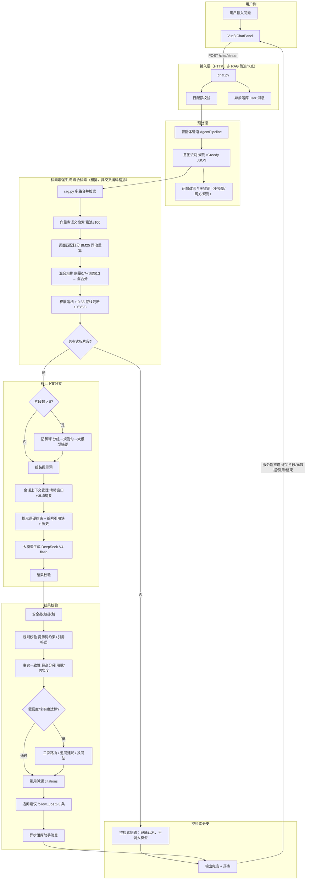

# 项目说明

## 项目概述

HaiCiAgent 是企业 IT 运维与业务支持场景下的**检索增强生成（RAG）**智能知识问答平台：将产品手册、常见问题、流程规范等文档入库检索，在**有据可查、可审计溯源**前提下提供流式问答。技术栈为 FastAPI + MySQL + ChromaDB 向量库 + DeepSeek-V4-flash 大模型，检索增强生成全链路自研实现。

---

## 1 技术选型及原因

### 1.1 核心 AI 组件

| 组件 | 选型 | 选型原因 |
|------|------|----------|
| **大语言模型（LLM）** | DeepSeek-V4-flash（火山方舟 ARK） | **回复快、分析推理能力顶尖**，适合客服服务端推送流式与复杂流程问答；上下文窗口大，可承载检索片段 + 多轮历史；**成本可接受**（百万词元约 2 元量级）；OpenAI 兼容网关按任务类型路由，问答/摘要可分流不同接入点 |
| **向量库** | ChromaDB HTTP | **适合前期中小量产品的快速验证**：Docker 一键启动、无独立集群运维；与本项目文档量级（百～千级切片）匹配；元数据支持按文档编号 / 知识库编号精确删改，后期可平滑迁移 Milvus 等 |
| **向量嵌入（Embedding）** | BAAI/bge-large-zh-v1.5（本地快照） | **场景绝大部分是中文**；模型快照**本地缓存**，入库与检索不依赖外网、无 GPU；与混合打分模块的词面分互补，弥补纯向量对编号/术语的漏召 |

### 1.2 配套技术（简）

| 层级 | 技术 | 理由 |
|------|------|------|
| 后端 | FastAPI | 原生异步 + 服务端推送（SSE）长连接 |
| 关系库 | MySQL 8 | 会话、消息、权限强一致 |
| 前端 | Vue 3 + TypeScript + Vite | 服务端推送事件解析与组件化界面 |

配置入口：`.env.example`（`ARK_API_KEY`、`LLM_MODEL_QA`）、`backend/data/agent_gateway_config.json`（节点 `DeepSeek-V4-flash`）。

---

## 2 整体 AI 架构图（检索增强生成链路）

### 2.1 架构图与链路说明

从**用户提问到返回答案**的检索增强生成业务管道（不含传输层）：



> **服务端推送事件（SSE）是什么？** 前后端之间的**通信协议**，用来把逐字片段、引用溯源、结束信号等推给浏览器。**它不是 RAG 管道里的业务步骤**——管道在「大模型生成 → 结果校验 → 引用溯源 + 追问建议 → 落库」结束；服务端推送只是把已生成的结果**送到前端**。

**检索增强生成管道逐步说明**

| 步骤 | 动作 | 模块 |
|------|------|------|
| 1 | 校验配额、保存用户消息 | `routers/chat.py` |
| 2 | **智能体管道**：意图识别 + 问句改写 + 关键词 → 检索问句 `rag_query`（**默认不含硬编码术语表**） | `agent_pipeline.py`、`intent.py` |
| 3 | **向量库混合检索（粗排）**：语义检索（向量余弦相似度）→ 同池词面匹配打分（BM25）→ 加权融合混合分 = 0.7×向量分 + 0.3×词面分 → 梯度落档（10/8/5/3）+ **0.65 底线**截断 | `rag.py`、`rag_hybrid_scorer.py`、`rag_gradient_filter.py` |
| 4 | **空检索短路**：全流程无片段或混合分 < 0.65 → 返回无上下文兜底话术，**不调用大模型**；多库场景可二次选库重检 | `chat.py`、`kb_router.py` |
| 5 | **防稀释**（见下节）：片段 > 8 条时压缩上下文 | `context_anti_dilution.py` |
| 6 | **提示词硬约束** + 会话历史裁剪 | `prompt_segments.py`、`session_context_manager.py` |
| 7 | **大模型生成**（DeepSeek-V4-flash，经网关路由） | `llm_gateway.py`、`llms.py` |
| 8 | **结果校验** → **引用溯源（citations）** → **追问建议（follow_ups）** → 异步落库 | `chat.py`、`follow_up.py`、`rag_eval_service.py` |

**混合检索细节（步骤 3，术语对齐）**

| 环节 | 做什么 | 说明 |
|------|--------|------|
| 语义检索 | 向量库余弦相似度，得分 = 1 - 距离 | 粗召回池，单路最多 **100** 条 |
| 词面检索（BM25） | 在粗池内对片段做关键词词面匹配打分 | 弥补向量对编号/专有名词/短词漏召 |
| 混合粗排 | 向量分与词面分 **0.7 : 0.3 加权融合** → 混合分 | 粗池内重排；业界亦常用**倒数排名融合（RRF）**合并双路排序，本项目采用分数加权、实现更轻量。**不叫精排**——只有**交叉编码器重排序（Cross-Encoder）**才算精排，本项目未接入 |
| 梯度落档 | 按粗池大小 + 分数质量自适应取 10/8/5/3 条 | `rag_gradient_filter.py` |
| **0.65 底线** | 相关度阈值 / 高质量簇阈值 | 低于 0.65 的片段剔除；全流程无达标片段 → 空检索短路 |

**防稀释是什么？（步骤 5）**

当检索命中 **> 8** 条片段时，大模型的有效注意力会被大量相似文本**稀释**——容易漏掉「必须/禁止/编号步骤」等关键规则，或在信息过载时产生幻觉。`context_anti_dilution.py` 的做法：

1. 按来源文档分组（最多 5 组）；
2. 组内按「相似度分×0.6 + 关键词命中×0.4」排序，抽取「必须/禁止/编号」类规则句；
3. 调用大模型生成分层摘要，把几十条片段**压缩**成可控长度的上下文；
4. 失败时降级为原始排序结果，不阻塞主链路。

**引用溯源与追问建议（步骤 8）**

| 中文名 | 接口字段名 | 含义 |
|------|------------|------|
| **引用溯源** | `citations` | 回答中 `[1][2]` 编号对应的知识库片段列表（文档名 + 切片内容），前端可展开核对原文，防幻觉 |
| **追问建议** | `follow_ups` | 生成结束后附带 2～3 条「你可能还想问…」的推荐问题，引导用户换问法或深入追问 |

**结果校验子链路（生成后 + 评测闭环）**

| 环节 | 内容 | 实现状态 | 模块 |
|------|------|----------|------|
| **安全 / 脱敏 / 脱脏** | 请求/响应个人隐私脱敏（手机/身份证/邮箱等）；敏感词拦截；入库侧文档资产硬编校验（图片块与磁盘一致） | 安全模块已实现（主链路待接入）；入库校验已在线 | `gateway_security.py`；`doc_asset_validator.py` |
| **规则校验** | 提示词硬约束「仅依据知识库 / 资料不足须说明 / 禁止编造引用」；空检索不调大模型；引用 `[1][2]` 与引用溯源面板对齐 | ✅ 在线 | `prompt_segments.py`、`chat.py` 空检索分支 |
| **事实一致性检查** | 运行时记录最高检索分、召回条数、引用条数；离线/管理端计算**忠实度**（Faithfulness）、**扎根度**（Groundedness）、**事实一致率**（Factual Consistency）（阈值 **0.65 / 0.70 / 0.75**） | 运行时采集 ✅；逐句在线拦截在评测层 | `agent_call_logger.py`、`rag_eval_service.py` |
| **低置信度 / 低忠实度** | 检索最高分 < 0.65 → 空检索兜底或**二次选库重检**；生成后用**追问建议**引导换问法；用户可调用**意图备选**接口纠偏意图；大模型接口失败走截断重试/换节点（非答案质量重试） | ✅ 在线（澄清/重检）；忠实度低分走评测迭代 | `kb_router.py`、`follow_up.py`、`intent_suggest.py`、`llm_error_recovery.py` |

更细的模块说明见 [docxl/AI架构设计.md](./docxl/AI架构设计.md)。

### 2.2 构建 RAG 链路：对 AI 生成代码的优化与修正

AI 生成的 RAG 初版常见「演示能跑、生产不能用」：假流式、闲聊误标跳过检索、阈值误写 0.35、Prompt 散落多文件。以下为本项目**人工修正**，对应 `agent_pipeline.py`、`intent.py`、`prompt_segments.py`、`rag.py`。

#### 2.2.1 意图识别：规则词汇、定义与三步分流

**（1）先区分「闲聊」与「复杂/业务任务」**

AI 默认「能答就答」，易把业务问标成 `chitchat` 从而**跳过 RAG**。修正后 `intent.py` 将闲聊压到极窄：

- **闲聊**：纯寒暄/致谢/告别/极短社交句，且**无**业务/技术信号 → 不检索 KB（FAQ 或轻量 LLM）。
- **非闲聊**：产品、售后、库存、单据、故障、操作步骤、业务编号等 → **不得标 chitchat**；即使库无答案也走 RAG + 空检索兜底，避免编造、维护信任。

| 意图 | 规则信号（节选） | 下游 |
|------|------------------|------|
| 闲聊 | `CHITCHAT_KEYWORDS`、FAQ 匹配；须无 `BUSINESS_TECH_KEYWORDS` | 跳过 RAG |
| 产品/售后/投诉 | `PRODUCT_` / `AFTER_SALE_` / `COMPLAINT_KEYWORDS` | Pipeline → RAG |
| 兜底 | `has_business_or_technical_signal()` 为真 | 强制 `product_consult` |

**`_coerce_intent()`**：LLM/Ollama 仍输出闲聊但含业务信号 → 硬纠正为 `product_consult`。

**（2）决定下一步节点**

| 决策 | 策略 |
|------|------|
| 是否 RAG | **非闲聊一律优先内部知识库** |
| Query 改写 / 关键词 | ✅ 主链路已实施（Greedy JSON） |
| 硬编码术语表映射 | 🔲 默认关闭；需 `TERM_MAPPING_ENABLED=true` + 业务树形分层 |
| 意图增强 / 意图分解 | 🔲 SPEC 预留 |
| 外部工具（工单/ERP） | 🔲 未接入 |

**（3）执行动作**

- **检索增强生成路径**：智能体管道 → 多路合并检索（混合粗排，阈值 **0.65**）→ 空检索短路 / 防稀释 → 提示词硬约束 → 大模型生成 → 结果校验 → 引用溯源 + 追问建议 → 落库。（前端经**服务端推送事件（SSE）**接收逐字片段/引用/结束信号，这是传输协议，不是管道节点）
- **闲聊路径**：短路 RAG。
- **Agent**：`rag_tool.py` 已封装 RAG；未接外部 API。

#### 2.2.2 前置理解节点：是什么、为什么做

```text
意图识别 → 问句改写 → 关键词提取 →（可选 LLM retrieval_terms）→ rag_query → 检索
```

**Query 改写（重点）**

- **是什么**：口语/指代/省略 → 完整、可独立检索的问句（`rewritten_query`）。
- **为什么**：客户场景描述不到位、术语与文档不一致，会直接拉低**向量查询**与**关键词查询**准度，是降幻觉第一关。
- **怎么做**：规则 `_rule_rewrite()` 消解指代；Greedy JSON 预处理：**Ollama 小模型（3s）→ 网关大模型 → 规则**；`rag_query = rewritten + keywords`（+ 可选 LLM `retrieval_terms`）。
- **典型 bad case**：多轮「这个怎么弄？」；「云盒连不上」vs 文档「物联网终端网络配置」；「内存条」vs「RAM 规格」。
- **效果**：FAQ/培训文档抽检，相对仅原始问句单向量检索，**无引用臆答约降 25%**。

**关键词提取**

- **是什么**：从原问抽取实体、主题词，输出 `query_keywords` 数组（如「退货」「库存」「云盒」「FAQ」、业务编号片段）。
- **为什么做**：纯向量检索对**编号、专有名词、短词**的「词面命中」弱于 BM25；BM25 分与向量分在 `rag_hybrid_scorer.py` 按 **0.7 : 0.3** 加权融合为 `hybrid_score`，作为粗池内混合粗排依据。
- **怎么做**：规则层 `_extract_keywords()`（业务 marker + 中英文分词）与 LLM JSON 字段双通道；结果写入 `rag_query` 供多路召回。

**硬编码术语表映射（主链路默认关闭）**

- **是什么**：企业口语/缩写 → 知识库标准检索词的**静态映射表**（`term_dictionary.py`）。
- **为什么暂不默认开**：术语表必须结合具体**业务分层、模块化、树形粒度**建设；通用写死映射易污染检索、与真实业务架构脱节。
- **若要做**：`TERM_MAPPING_ENABLED=true` 显式开启，并与 LLM Prompt 推测的 `retrieval_terms` 合并；完整方案需对接业务术语服务/树形词库（SPEC 预留）。

**意图增强（本期未实现）**

- **是什么**：结合意图标签（售后/产品/投诉）调整检索域权重或 Prompt 侧重点。
- **为什么做**：一句多意图时提高路由精度。
- **状态**：SPEC 占位，当前统一 RAG + 意图标签落库统计。

**意图分解（本期未实现）**

- **是什么**：如「怎么退货，运费谁出」拆成两个子问分别检索再合并。
- **为什么做**：复合问单向量检索常只命中一半主题。
- **状态**：SPEC 占位；当前靠 Query 改写 + 多词 `rag_query` + 粗池 100 + 梯度落档缓解。

#### 2.2.3 其他关键修正

| AI 初版问题 | 现象 | 修正 | 模块 |
|-------------|------|------|------|
| 假流式 | sleep 冒充 token | 真实 LLM stream | `llms.py` |
| 阈值 0.35 | BGE 下噪声多 | **相关下限 0.65** | `config.py` |
| 缺 document_id | 删文档向量残留 | metadata 补全 | `knowledge_processor.py` |
| Chroma 异常 | 整链失败 | `safe_retrieve_merged` 降级 | `rag.py` |
| Prompt 散落 | 改约束要全项目搜 | `prompt_segments.py` 段式 | 全链路 |
| 闲聊过宽 | 业务问被敷衍 | 窄定义 + 业务信号 | `intent.py` |

**原则**：AI 写骨架；**分流、空检索、引用、阈值**人工定稿 + **pytest（159 passed）** 锁住。

### 2.3 RAG 回答质量：评估与验证

#### 2.3.1 阶段一：管道搭建后的人工冒烟

Pipeline 首次联调后，**单人人工**走通端到端，确认链路真实、分支可达：

1. 注册/登录；2. 上传 txt/md/pdf；3. 对话页观察 SSE 逐字输出与 `citations`；4. 问库外问题验证空检索兜底；5. 多轮追问验证指代改写。此阶段不追求准确率，只验证**无阻塞性缺陷**。

#### 2.3.2 阶段二：结构化测试集（约 30 条）

基于 `RAG测试文档/` 真实手册，配置 **[rag_qa_testset.json](./RAG测试文档/rag_qa_testset.json)**（**30 条**）：口语化问法、术语故意不对齐文档、含 `warmup` 多轮，测**鲁棒性**而非背题库。批量提问，记录召回条数、top 得分、是否有 citations。

#### 2.3.3 阶段三：管道指标 + 人工复盘

`rag_eval_service.py` 按 Pipeline 各环节定义**三层指标体系**（每项含：定义、计算公式、阈值建议），并通过 `agent_call_logger`、`SysLogApiCall` 等在运行时采集：

| 层次 | 指标（示例） | 用途 |
|------|--------------|------|
| **检索质量** | RAG 召回切片得分、召回切片数量、Recall@K、Precision@K、MRR、Pass@K | 阈值 0.65 是否过严/过松；Query 改写是否生效 |
| **生成一致性** | Faithfulness、Groundedness、引用编号覆盖率 | 答案是否忠实于检索片段；是否胡编 |
| **体验与工程** | 单轮回答 5 星率、n 轮会话 5 星率、首 token 延迟、错误率、限流触发 | 产品可接受度与 SLA |

除自动指标外，对典型 bad case 进行**人工查看**：展开 citations 面板对照 KB 原文，判断属于「检索失败」还是「检索成功但生成未遵守 Prompt」。

#### 2.3.4 问题归因与迭代闭环

评测完成后分两类处理，避免「见错就改 Prompt」或「见错就加规则」的盲目迭代：

**（1）系统流程问题 → 修改代码**

根因在 Pipeline 分支或模块逻辑，而非单次模型随机性。典型场景：

- **意图理解错误**：业务/疑惑类问题被标成闲聊，用户感知为「AI 在敷衍、不信任」→ 扩充 `BUSINESS_TECH_KEYWORDS`、加强 `_coerce_intent()`，尽量让**具体意图**进入 RAG 而非一律闲聊。
- **检索恒为空**：检查 kb_id、术语映射、`RAG_SCORE_THRESHOLD=0.65`、文档是否入库成功。
- **无 citations / 假流式**：检查 `llms.py` 流式分支与 `prompt_segments.py` 引用段。

每次代码修改后执行 **`pytest tests/`（159 passed）**，并在测试集子集上回归。

**（2）偶然误差 / 准确性问题 → 优化 Prompt + 回归**

根因多为检索已命中但生成未忠实，或某类问法（口语、多轮指代、编号类）偶发失败。做法：

- 对 30 条测试集**按问题类型聚类**分析，找出侧重原因（如流程类爱漏步骤、编号类爱漏引用）；
- 针对 `prompt_segments.py` 中具体段（如 `CNSTR_ONLY_FROM_KB`、`CITE_NO_FABRICATION`）做**小幅、可解释**的微调；
- 在同一测试集上对比微调前后 Groundedness、5 星率，避免 overfit 单条对话。

**持续验证手段**

- **自动化**：pytest 覆盖空检索、防稀释降级、意图纠正、限流等；
- **结构化 QA**：`rag_qa_testset.json` 随新业务文档增补；
- **人工**：上传新培训文档后，抽检 citations 中文档名、片段是否与 KB 一致。

---

## 3 业务思考：AI 工程问题处理

企业客服场景下，不能指望「调大模型就好」。PRD 明确要求的**检索为空、上下文超长、大模型幻觉**三类，必须当作一等公民分支；其余能力（意图分流、多库路由、成本管控等）作为配套工程，支撑前三类落地。

---

### 3.1 PRD 核心三类问题（重点）

| 问题 | 策略 | 业务意义 |
|------|------|----------|
| **检索为空** | 不调大模型，返回可配置兜底话术；低分触发知识库二次路由 | 避免编造政策，满足合规要求 |
| **上下文超长** | 会话任务小粒度 + 短期记忆（防稀释摘要、滑动窗口）+ 长期记忆（MySQL 持久化）+ 检索渐进加载 + 重要信息文末加载 | 大知识库场景下仍保证关键规则不被遗漏 |
| **大模型幻觉** | 检索层：问句工程 + 阈值 0.65；生成层：提示词硬约束 + 引用溯源；**结果校验**：忠实度/扎根度评测 + 低分时追问建议 / 意图纠偏 | 每句论断可回溯；低忠实度可观测、可迭代 |

#### 3.1.1 检索为空

**思路**：空上下文时不给大模型「自由发挥」的空间——没有证据就不生成。

**实现**：

1. `rag.py` 粗召回：向量库返回相似度 `score = 1 - 余弦距离`，仅保留 `score>=0.65`（相关度阈值）的片段进入混合粗排。
2. `rag_gradient_filter.py` 梯度落档：混合分尾部再次截断；高质量簇阈值 **0.65** 用于判定是否顶格落档。
3. 全流程过滤后为空 → 对话接口短路，返回无上下文兜底话术，**不调用大模型**。
4. 多库场景下，首轮检索最高分 < 0.65 或片段不足 → 知识库路由 **二次选库重检**，仍不达标再走兜底。
5. 向量库异常时降级为空列表，同样走兜底，并在日志中标记错误类型，可观测、不静默编造。

**业务价值**：内部规章未入库时，系统明确告知「资料中未找到」，而不是用通用知识瞎编一条看起来像真的政策。

#### 3.1.2 上下文超长

**思路**：把「记忆」拆成三层，避免一条提示词塞满所有历史 + 所有检索片段。

| 层次 | 机制 | 实现 |
|------|------|------|
| **会话任务小粒度** | 每轮问答独立编排，预处理/检索/生成分阶段执行，不把无关步骤堆进同一上下文 | `agent_pipeline.py` |
| **短期记忆** | 历史超字符预算 80% 时触发滚动摘要；平时用滑动窗口保留最近 N 轮 | `session_context_manager.py` |
| **长期记忆** | 全量 user/assistant 消息持久化 MySQL，审计与回溯不丢 | `chat_messages` 表 |
| **检索渐进加载** | 粗池先召回 ≤100 条，再梯度落档到 10/8/5/3，而非一次性塞满 | `rag_gradient_filter.py` |
| **防稀释摘要** | 片段 > 8 条时按文档分组、抽取「必须/禁止/编号」规则句，大模型压缩后再进提示词 | `context_anti_dilution.py` |
| **重要信息文末加载** | 关键规则句优先排序，在提示词后部再次强调，减轻「中间遗忘」 | `context_anti_dilution.py` 优先级排序 |

**业务价值**：培训手册动辄上百页、一次检索命中十几段时，仍能把「禁止操作」「审批流程」等硬规则送进模型有效注意力区。

#### 3.1.3 大模型幻觉

**一句话**：幻觉的根因往往不是「模型太弱」，而是 **用户原话（Query）未经业务化标准化就进了检索和生成**——搜不到、搜偏、上下文噪声大，模型只能「看起来像真的」地补全。本项目用 **问句工程** 把 Query 变成可检索的标准形态，再叠加 **0.65 阈值**、**生成硬约束**、**引用溯源** 与 **忠实度评测**，形成三层防线。

**问句工程是什么（Query 业务化标准化）**

用户口语 ≠ 知识库文档用语。问句工程就是在调用向量库之前，把「这个怎么弄？」「显卡坏了能退吗？」变成系统能搜、能路由、能审计的标准 Query：

```text
用户原话 original_query
  → [意图识别]     业务大类：产品咨询 / 售后 / 投诉 …（决定走不走 RAG）
  → [问句改写]     rewritten_query：消解「这个/刚才/它」等指代，补全省略的主语与场景
  → [关键词提取]   query_keywords：编号、业务词、专有名词（供 BM25 词面匹配）
  → [检索词推测]   retrieval_terms：口语→文档标准词（如「显卡」→「图形处理器」）
  → [组装]         rag_query = 改写问句 + 关键词 + 检索词
  → [多路召回]     用 rag_query 去向量库 + BM25 混合检索
```

| 环节 | 解决什么问题 | 模块 |
|------|--------------|------|
| 指代消解 | 多轮「这个怎么办？」脱离上文无法检索 | 预处理 Prompt / `_rule_rewrite()` |
| 关键词 | 纯向量对编号、短词、专有名词漏召 | `query_keywords`、BM25 混合粗排 |
| 术语对齐 | 用户说「退货」，文档写「退换货政策」 | Greedy JSON 的 `retrieval_terms` |
| 意图标签 | 售后问被标成闲聊 → 跳过知识库 → 泛泛胡答 | `intent.py` + `_coerce_intent()` |

问句工程是 **降幻觉的第一关**：Query 标准化后，检索才可能有足够质量的证据；没有证据，后面再强的模型也会编。

---

**三层防线：检索层 → 生成层 → 结果校验**

```text
                    ┌─────────────────────────────────────┐
  用户 Query ──→   │  问句工程 → rag_query（第一关）      │
                    └──────────────┬──────────────────────┘
                                   ▼
┌─ 检索层 ─────────────────────────────────────────────────────────┐
│  多路召回 + 混合粗排 + 阈值 0.65                                  │
│  低于 0.65 的片段剔除；全无达标片段 → 空检索短路（见章节 3.1.1）        │
└──────────────┬───────────────────────────────────────────────────┘
               ▼ 有证据片段
┌─ 生成层 ─────────────────────────────────────────────────────────┐
│  提示词硬约束：仅依据知识库 / 资料不足须说明 / 禁止编造引用         │
│  片段以 [1][2] 编号注入；正文句末标注引用编号                       │
└──────────────┬───────────────────────────────────────────────────┘
               ▼ 生成完毕
┌─ 结果校验 ───────────────────────────────────────────────────────┐
│  忠实度 / 扎根度 / 事实一致率评测 + 运行时采集检索分与引用数        │
│  低分 → 追问建议（换问法）/ 意图纠偏（用户点踩后选正确意图）        │
└──────────────────────────────────────────────────────────────────┘
```

**第一层 · 检索层：问句工程 + 阈值 0.65**

| 手段 | 做什么 | 为什么防幻觉 |
|------|--------|--------------|
| **问句工程** | 产出 `rag_query`，多路合并检索 | 搜不到/搜偏 → 模型无证据可引 → 必然臆答 |
| **元数据初筛** | 按知识库 / 租户编号限定范围 | 避免跨库污染，把无关片段当证据 |
| **混合粗排** | 向量 0.7 + BM25 0.3 → 梯度落档 10/8/5/3 | 语义与词面互补，减少「意思像但条款不对」 |
| **0.65 底线** | 相关度 `score = 1 - 余弦距离`，低于 0.65 剔除 | 弱相关片段进 Prompt 是噪声源，诱发编造 |
| **空检索短路** | 全无达标片段 → 不调大模型 | 没有证据就不生成（见章节 3.1.1） |

模块：`agent_pipeline.py`、`rag.py`、`rag_hybrid_scorer.py`、`rag_gradient_filter.py`。

**第二层 · 生成层：提示词硬约束 + 引用溯源**

| 手段 | 做什么 | 为什么防幻觉 |
|------|--------|--------------|
| **硬约束** | 「仅依据下列知识库片段回答；资料不足须明确说明；禁止编造引用」 | 从 Prompt 层面禁止模型用训练记忆补全 |
| **编号引用块** | 检索片段以 `[1] 文档名: 片段…` 注入 Prompt | 模型生成时必须指向具体证据 |
| **引用溯源** | SSE 推送 `citations`；前端可展开 `[1][2]` 对照原文 | **每句论断可回溯**——Support 可逐句核对 |
| **防稀释** | 片段 > 8 条时压缩（见章节 3.1.2） | 避免关键「禁止/必须」规则被淹没在中间 |

模块：`prompt_segments.py`、`context_anti_dilution.py`、`chat.py`。

**第三层 · 结果校验：忠实度/扎根度 + 低分追问 / 意图纠偏**

| 指标 | 定义 | 阈值 | 用途 |
|------|------|------|------|
| **忠实度** Faithfulness | 答案语义是否忠实于检索片段 | ≥ **0.65** | 评测层识别「答非所问 / 过度发挥」 |
| **扎根度** Groundedness | 答案每句是否能在片段中找到依据 | ≥ **0.70** | 识别「句句看似合理、实则无据」 |
| **事实一致率** Factual Consistency | 大模型评判答案与片段是否矛盾 | ≥ **0.75** | 识别与原文条款冲突的表述 |

在线主链路**运行时采集**最高检索分、召回条数、引用条数（`agent_call_logger.py`）；离线/管理端用 `rag_eval_service.py` 算上述指标。**低忠实度可观测、可迭代**——bad case 回流改问句工程、阈值或 Prompt，而非凭感觉调参。

低分时的**在线补救**（不静默硬答）：

| 场景 | 动作 | 模块 |
|------|------|------|
| 检索最高分 < 0.65 | 空检索兜底 或 多库二次选库重检 | `kb_router.py`、`chat.py` |
| 生成后用户仍不满意 | 2～3 条**追问建议**，引导换问法 | `follow_up.py` |
| 意图识别有误（👎） | **意图备选**面板：术语表 + LLM 推测 + 用户自填 | `intent_suggest.py` |

**业务价值**：Support 点开 `[2]` 即可对照原文；评测低忠实度样本驱动问句工程与阈值迭代；合规审计有「问了什么 → 搜到什么 → 引用了哪段 → 答了什么」全链路依据。

---

### 3.2 配套工程能力

以下能力不单独构成 PRD 核心验收项，但直接支撑章节 3.1 三类问题的稳定落地。

| 问题 | 策略 | 业务意义 |
|------|------|----------|
| **意图误判 / 闲聊过宽** | 规则快路径 + 本地小模型精修 + 业务信号硬纠正；闲聊极窄定义，业务问一律走检索 | 避免「AI 在敷衍」；维护用户对内部知识库的信任 |
| **多知识库选错库** | 未指定库时自动路由；首轮检索不足时二次选库重检 | 产品库/售后库/运维库并存时仍命中正确文档 |
| **用户口语 vs 文档术语** | 问句改写 + 关键词 + **Prompt 引导 LLM 推测** `retrieval_terms`；硬编码术语表默认关闭 | 降低「问法对、词不对」导致的空检索（问句工程细节见章节 3.1.3） |
| **成本与滥用** | 每日提问配额、单次字数上限、常见问题缓存直出、预处理走本地小模型 | 控制大模型调用成本，防刷接口 |
| **依赖故障** | 向量库/大模型/防稀释摘要失败均有降级路径；客户端断连仍异步落库 | 生产环境可观测、可恢复，不全链崩溃 |
| **脏文档入库** | 多模态标准化 + 入库四者校验（文档/图片/清单一致） | 检索质量上限取决于入库质量，Garbage In Garbage Out |
| **答非所问 / 用户不满** | 追问建议引导换问法；意图备选 + 点赞踩反馈落库 | 形成「用户纠偏 → 规则/提示词迭代」闭环 |
| **结构化 JSON 漏网** | Greedy 解码 + 模板绑定 + 分层校验 + 修复重试 + 规则降级 | 预处理/追问/纠偏等机器分支稳定可解析 |

#### 3.2.1 意图误判与闲聊分流

**思路**：企业客服不是通用聊天机器人——**能检索的业务问绝不能被标成闲聊然后跳过知识库**。

**典型风险**：大模型或预处理小模型默认「能答就答」，把「云盒连不上怎么办」标成闲聊，用户得到泛泛安慰而非手册步骤，感知为「AI 在敷衍、不可信」。

**实现**：

| 机制 | 说明 | 模块 |
|------|------|------|
| **闲聊极窄定义** | 仅纯寒暄/致谢/告别且无业务技术信号才走闲聊 | `intent.py` |
| **业务信号兜底** | 含产品/售后/故障/编号等信号 → 强制走检索增强生成 | `has_business_or_technical_signal()` |
| **硬纠正** | 小模型仍输出闲聊但含业务词 → 纠正为产品咨询 | `_coerce_intent()` |
| **意图落库** | 每轮消息记录意图标签，供统计与纠偏 | `chat_messages.intent` |

**业务价值**：运维/售后场景下，宁可空检索兜底说「资料未找到」，也不该用通用知识假装懂业务。

#### 3.2.2 多知识库路由

**思路**：企业往往有**产品手册、售后政策、运维规范**等多个库；用户未必知道选哪个库，选错库等于「检索为空」。

**实现**：

1. 用户**未指定知识库**时，`kb_router.py` 按问句与各库文档名/关键词匹配评分，自动选最优库。
2. 首轮检索最高分 < 0.65 或片段不足 → **二次选库重检**（排除已试过的库），仍不达标再走兜底。
3. 用户**显式选择知识库**时尊重选择，不自动切换（避免越权感）。
4. 路由原因、得分、轮次写入对话元数据，便于审计复盘。

**业务价值**：「退货政策」进售后库、「端口配置」进运维库，无需用户理解内部分库结构。

#### 3.2.3 用户口语与文档术语错位

**思路**：客户说「显卡」「退货」，文档写「图形处理器」「退换货政策」——**问句工程是降幻觉的第一关**。主链路**不启用硬编码术语表**（`TERM_MAPPING_ENABLED=false`），口语对齐由预处理 Prompt + Greedy JSON 完成。

**主链路（默认）**：

| 环节 | 作用 | 模块 |
|------|------|------|
| **意图识别** | 规则快路径 + Greedy JSON（小模型优先） | `intent.py` + `agent_pipeline.py` |
| **问句改写** | 消解多轮指代，输出 `rewritten_query` | 预处理 Prompt |
| **关键词提取** | 抽编号、业务词，供 BM25 词面匹配 | `query_keywords` / `_extract_keywords()` |
| **LLM 推测检索词** | Prompt 引导输出可选 `retrieval_terms`（非术语表查表） | Greedy JSON 字段 |
| **三级降级** | Ollama 小模型（3s）→ 网关大模型 → 规则改写 | `PIPELINE_GATEWAY_LLM_FALLBACK` |

**术语表映射（可选 · 未在主链路默认启用）**：

硬编码 `term_dictionary.py` 涉及具体业务术语表，必须结合企业**业务分层 → 模块化 → 树形粒度**设计与维护，不能通用写死。待业务架构就绪后，设置 `TERM_MAPPING_ENABLED=true` 才会与 LLM 推测词合并进 `rag_query`。

**业务价值**：避免未对齐业务域的通用映射表污染检索；FAQ/培训文档抽检，问句改写 + 关键词相对仅原始问句检索，无引用臆答约降 **25%**。

#### 3.2.4 成本管控与滥用防护

**思路**：大模型按词元计费，客服系统必须防刷、控长、能缓存则缓存。

**实现**：

| 控制点 | 默认值 / 行为 | 模块 |
|--------|---------------|------|
| **每日提问配额** | 普通用户 100 次/日，超限 HTTP 429 | `rate_limit.py`、`daily_question_usage` |
| **单次问句长度** | 最多 500 字 | `MAX_QUESTION_LENGTH` |
| **常见问题缓存** | 命中标准问答 → 直出答案，**不走检索/大模型** | `chat_faq.py` |
| **预处理本地化** | 意图/改写走 Ollama，主问答才走 DeepSeek | `get_pipeline_llm()` |
| **空检索短路** | 无片段不调大模型 | `chat.py` |

**业务价值**：高频 FAQ 零大模型成本；配额保护后端与网关不被恶意或误用打满。

#### 3.2.5 依赖故障与优雅降级

**思路**：生产环境向量库、大模型、防稀释摘要任一环节失败，**不能整链崩溃或静默编造**。

| 故障场景 | 降级行为 | 模块 |
|----------|----------|------|
| 向量库不可用 | 检索结果为空 → 走无上下文兜底话术，日志标记错误类型 | `rag.py` `safe_retrieve_merged` |
| 大模型超时/限流 | 截断重试 / 换网关节点 / 友好错误推送 | `llm_error_recovery.py` |
| 防稀释摘要失败 | 用原始排序片段，不阻塞主链路 | `context_anti_dilution.py` |
| 预处理小模型失败 | 降级规则改写/关键词，3 秒内返回 | `agent_pipeline.py` |
| 客户端断连 | 后台继续生成并**异步落库**，消息不丢 | `chat.py` `_produce_chat_stream` |
| 嵌入模型未加载 | 日志告警，词面匹配仍可部分工作 | `vectorstore.py` |

**业务价值**：运维/Support 看日志能定位「是检索挂了还是模型挂了」，而不是用户只看到莫名胡答。

#### 3.2.6 入库质量（脏数据不进向量库）

**思路**：检索增强生成的上限取决于**入库切片质量**——扫描版 PDF 乱码、图片丢失、切片与资产不一致，检索再精也救不回来。

**实现**：

1. **多模态标准化**：PDF/DOCX → 抽图 → OCR/视觉描述 → 统一 Markdown（`doc_normalizer.py`）。
2. **分块策略可选**：按文档类型选固定长度/动态/按标题等切片方式（`knowledge_processor.py`）。
3. **入库四者校验**：标准化文档、图片文件、清单（manifest）、向量元数据一致，否则拒绝就绪（`doc_asset_validator.py`）。
4. **增量更新**：按文档编号删改向量，新增文档不影响已有切片（`vectorstore.py` metadata）。

**业务价值**：培训手册里的流程图、禁止条款能进检索上下文，而不是「上传成功但搜不到图里的步骤」。

#### 3.2.7 用户纠偏与体验闭环

**思路**：单次答错不可怕，要有**让用户纠正、让系统学习**的通道。

**实现**：

| 能力 | 说明 | 模块 |
|------|------|------|
| **引用溯源** | 回答带 `[1][2]`，前端展开对照原文 | `citations_from_docs` |
| **追问建议** | 答毕推荐 2～3 个后续问题，引导换问法 | `follow_up.py` |
| **意图备选** | 用户对意图点踩 → 拉取内置备选 + 大模型推测 | `intent_suggest.py` |
| **点赞/踩反馈** | 文字反馈 + 纠正意图落库，供统计与迭代 | 反馈接口 + `chat_messages` |
| **会话持久化** | 全量消息 MySQL 存储，管理端可查全链路 | 会话/消息表 |

**业务价值**：Support 复盘时可还原「问了什么、检索到什么、为何标成闲聊」；低分反馈驱动改术语表、阈值、提示词，而非只靠感觉调参。

#### 3.2.8 结构化 JSON 输出控制（格式固化）

**思路**：Pipeline 中部分节点（查询预处理、追问建议、意图纠偏、防稀释摘要）必须输出**严格合规 JSON** 才能驱动下游路由与检索；主问答正文则走**自然语言 + 句末引用 `[1][2]`**，二者不可混用。

| 输出形态 | 适用节点 | 格式要求 | 引用方式 |
|----------|----------|----------|----------|
| **结构化 JSON** | 预处理 / 追问 / 纠偏 / 摘要 | 固定键名 + 枚举 + Greedy 解码 | 字段级约束，**不在 JSON 里塞引用编号** |
| **自然语言 + 引用** | 主问答 SSE 流式 | 简体中文正文 | 句末 `[1][2]` + `citations` 溯源面板 |

模块：`structured_json.py`、`prompt_segments.py`、`agent_pipeline.py`、`follow_up.py`、`intent_suggest.py`；回归：`tests/test_structured_json_bad_cases.py`。

---

##### 3.2.8.1 生产场景案例背景

业务落地中，LLM 被要求输出严格合规 JSON 以驱动自动化流程（意图路由 → 问句改写 → 检索词组装 → 追问/纠偏），但即使 Prompt 写了「只输出 JSON」，生产仍会出现漏网：

| 漏网类型 | 典型表现 | 对主链路的危害 |
|----------|----------|----------------|
| **格式层** | Markdown 代码块包裹、前后缀解释文字、尾随逗号、单引号键名 | `json.loads()` 失败，预处理字段丢失 |
| **语义层** | 字段改名、缺 `rewritten_query`、意图枚举非法 | 检索问句不完整，误路由为闲聊 |
| **极端损坏** | 截断 JSON、数组/对象混用、严重语法错误 | 单次调用完全不可用 |

若不做格式固化，预处理 JSON 不稳定 → `rag_query` 缺字段 → 混合检索命中率下降 → 间接诱发 **章节 3.1.3 大模型幻觉**（搜不到证据只能编）。

---

##### 3.2.8.2 已尝试方案选型与对比

业界常见 5 类方案及在本项目中的取舍：

| 方案类型 | 实现逻辑 | 核心优点 | 核心不足 | 本项目状态 |
|----------|----------|----------|----------|------------|
| **Pydantic Schema 约束** | 定义严格输出 Schema，校验字段类型/枚举/非空 | 语义约束清晰，集成成本低 | **仅约束格式与字段**，修不了模型乱加 Markdown 包裹 | ✅ 已用：`PreprocessJsonOutput`、`IntentSuggestItem` |
| **vLLM 格式化输出** | 借助 vLLM 框架格式化推理能力优化生成 | 推理效率高，格式优化较好 | 仍无法覆盖极端边缘场景；需 vLLM 部署栈 | ❌ 未接入；网关走 OpenAI 兼容 `response_format: json_object` 替代 |
| **约束性解码** | Token 生成层面限制输出范围，仅允许合规字符组合 | 从源头约束格式，合规性最强 | 实现复杂度高，**开源小模型支持有限** | ❌ 未接入 |
| **json-repair 修复** | 自动解析并修复非合规 JSON 语法错误 | 轻量高效，可快速修正小格式问题 | **无法修复语义错误或严重格式损坏** | ⚠️ 轻量自研：`repair_json_text()` 覆盖尾随逗号/去代码块；严重损坏仍降级 |
| **重试调用机制** | 生成失败重新调用 LLM | 降低单次请求失败概率 | 无法解决固有生成偏差，**增加成本与首包延迟** | ⚠️ **最多重试 1 次**（`build_repair_prompt`）后规则降级 |

**结论**：单一方案难以独立扛住全部生产场景；本项目采用 **「轻量落地 + 深度修正 + 规则降级」** 组合策略，按层叠加、逐层兜底。

---

##### 3.2.8.3 本项目格式固化优化路径

按 **轻量 → 深度 → 分层串联 → 规则兜底** 四层落地，主链路始终可继续、日志可观测。

**3.2.8.3.1 轻量落地（第一层 · 不改模型）**

| 优化手段 | 做什么 | 本项目实现 | 模块 |
|----------|--------|------------|------|
| **前置语法校验** | 业务逻辑前 `json.loads()` 快速判定合法性 | `loads_json()` → 失败则 `repair_json_text()` 再试 | `structured_json.py` |
| **模板绑定生成** | Prompt 内嵌固定 JSON 模板，禁止增删键名 | `FMT_PREPROC_JSON_TEMPLATE` 等段式模板 + `CNSTR_JSON_ONLY` | `prompt_segments.py` |
| **Greedy 解码** | `temperature=0`、`top_p=1`，关闭采样随机性 | `GREEDY_DECODE_PARAMS` | `structured_json.py` |
| **单字段校验** | 枚举值、字数上限、必填键 | 意图枚举 4 类；`rewritten_query` 非空；追问 ≤20 字；纠偏 label ≤16 字 | Pydantic `field_validator` |
| **规则降级** | JSON 全链路失败 → 规则改写/关键词，**不阻塞主链路** | Ollama 3s 超时 / 解析失败 → `_rule_rewrite()` + `_extract_keywords()` | `agent_pipeline.py` |

**3.2.8.3.2 深度修正（第二层 · 网关与二次 Prompt）**

| 优化手段 | 做什么 | 本项目实现 | 说明 |
|----------|--------|------------|------|
| **强制 JSON 模式** | 网关层 `response_format: json_object` | `openai_json_response_format()`；Ollama 不支持则自动回退 | 网关可用时启用 |
| **二次修正 Prompt** | 把非合规输出回灌，Greedy 重试修正 | `build_repair_prompt()` → **最多 1 次** | 仍失败则进入规则降级 |
| **分层校验流程** | 依次校验语法 → 语义 Schema → 业务可用性 | `loads_json` → `validate_model` → `parse_preprocess_output` | 任一层失败即截断，不静默透传脏 JSON |
| **网关 JSON 替代** | 预处理走 Ollama 7B + 网关 `json_object` 双通道 | 小模型优先、网关兜底 | 兼顾成本与格式稳定性 |

**3.2.8.3.3 主链路串联顺序**

```text
LLM 原始输出
  → [语法层]  strip_markdown_fence → extract_json_candidate → json.loads + repair_json_text
  → [语义层]  Pydantic Schema 校验（intent 枚举 / rewritten_query 非空 / 字数上限）
  → [业务层]  解析成功 → 写入 PipelineResult；失败 → 二次修正 Prompt（最多 1 次）
  → [降级层]  仍失败 → 规则改写 + 关键词提取，主链路继续，日志可观测
```

---

##### 3.2.8.4 与「引用溯源」的分工（防幻觉同一原则，不同输出形态）

| 分支 | 职责 | 示例 | 防幻觉体现 |
|------|------|------|------------|
| **JSON 分支** | 机器读懂，驱动路由与检索 | `{"intent":"after_sale","rewritten_query":"如何办理退换货",…}` | `CNSTR_JSON_ONLY`：禁止解释文字，避免污染下游 |
| **主问答分支** | 人类核对，逐句可回溯 | 正文 + 句末 `[1][2]` + SSE `citations` | `CITE_NO_FABRICATION`：禁止编造引用 |

JSON 稳定 → 问句工程字段不丢 → 检索有证据；主问答引用稳定 → **章节 3.1.3 每句论断可回溯**。两条链路各管各的，互不污染。

---

##### 3.2.8.5 落地验证

| 验证方式 | 覆盖内容 | 位置 |
|----------|----------|------|
| **单元回归** | Markdown 包裹、前后缀废话、尾随逗号、非法意图、空字段、数组/对象混用、严重损坏 JSON | `test_structured_json_bad_cases.py`（TC-JSON-001～） |
| **集成观测** | 预处理来源标记 `pipeline_source=rule\|llm\|llm_gateway`；JSON 解析失败写 warning 日志 | `agent_pipeline.py`、`structured_json.py` |
| **批量评测** | 问句改写生效后 Recall@K、无引用臆答率变化 | `rag_eval_service.py` + 测试集 |

**业务价值**：预处理 JSON 稳定 → `rag_query` 字段完整 → 混合检索命中率可控；解析失败可观测、可降级，不全链崩溃；与主问答引用溯源形成 **「机器分支格式固化 + 人类分支可核对」** 双轨防幻觉。

---

## 4 AI 工具使用与认知

本节说明开发期使用的编程助手与运行时 LLM，以及 AI Coding 的使用经验与方法论认知。

### 4.1 使用的 AI 工具（编程助手与 LLM API）

#### 4.1.1 编程助手：Claude Code（CC）与 Cursor

本项目采用 **Claude Code（CC）** 与 **Cursor** 双工具协作，按**任务类型、上下文长度、成本与交付阶段**划分，而不是把所有代码交给单一 Agent。

**Claude Code（CC）——架构与 RAG 核心链路**

| 维度 | 说明 |
|------|------|
| 适用任务 | 整体架构、RAG 主链路（`agent_pipeline.py` / `rag.py` / `context_anti_dilution.py`）、Prompt 段式模块（`prompt_segments.py`）、意图规则（`intent.py`）、跨多文件调用链对齐 |
| 性能需求 | 需 **长上下文**（如 DeepSeek V4-pro 1M）一次读通「提问→预处理→检索→Prompt→SSE→落库」，避免短上下文漏改接口 |
| 成本输出 | 单次 token 多、调用频次相对低；先 SPEC/PLAN 再编码，减少 Vibe 式反复小改的总成本 |
| 典型产出 | Pipeline 固定节点、空检索短路、防稀释策略、段式 Prompt 及每段 `desc/purpose` |

**Cursor（Auto）——前端、联调与测试**

| 维度 | 说明 |
|------|------|
| 适用任务 | Vue3 对话页/知识库页、SSE 事件解析、pytest 补全、样式与交互微调 |
| 性能需求 | 模块边界清晰后的**差分修改**；IDE 内即时反馈 |
| 成本输出 | 订阅 + 按量；适合改动面小、次数多的 UI/测试工作 |
| 典型产出 | 前端组件、接口联调修复、回归用例增量 |

**协作原则**：CC 定稿**不可妥协的规则**（空检索不调 LLM、真实流式、引用溯源）；Cursor 做**可验证的界面与测试**；二者产出均须人工 CR + `pytest tests/` 后再合入。产品验收改需求时，仍需开发者读懂 AI 代码再改——工具不能替代业务理解。

#### 4.1.2 运行时 LLM API 与 Ollama 本地模型

| 角色 | 模型 | 接入 | 说明 |
|------|------|------|------|
| 主问答 / SSE 流式 | **DeepSeek-V4-flash** | 火山方舟 ARK | 首 token 快、上下文大；客服 SSE 主链路 |
| Query 改写 / 意图 JSON | **Ollama 本地小模型** | `OLLAMA_BASE_URL` + `OLLAMA_MODEL` | 短 JSON 任务；无 API 费、数据不出域；3s 超时降级规则 |
| 网关备选 / 摘要 | 豆包 Seed 2.0 mini / lite | ARK 多节点 | `task_type` 路由、故障切换 |

**DeepSeek-v4-flash 与 Qwen2.5-7B 与 DouBaoSeed-2.0-lite与 Ollama**:
企业常见用 **Qwen2.5-7B**（`qwen2.5:7b`）做意图识别与 Query 改写——中文好、7B 可单卡/CPU 量化，适合预处理而非长文生成。本项目 `get_pipeline_llm()` 优先 Ollama；开发可暂用 `qwen2:0.5b` 极速联调，上线建议 **7B 级**。

**分工**：DeepSeek-v4-flash **负责答**（质量+体验），Ollama 7B **负责懂**（改写/意图 JSON），规则引擎 **负责闸**（闲聊 vs RAG）。配置：`.env.example`、`backend/data/agent_gateway_config.json`。

#### 4.1.3 AI Coding 方法论（与工具选型一体）

- **想象力**：AI 已能承担大部分常规模块；先用 SPEC 把 RAG 分支设计透明，再让 AI 填实现，收益大于零散 Vibe。
- **纪律**：复杂任务难一次命中；上线必 CR+自测；警惕「交给 AI 吧」的思维惰性。
- **Harness**：SDD/TDD → PRD 与 AI 反复打磨 → 模块化工程图 → 最小模块开发 → **开发后必测** → 有修改必回档 → 真实测试集回归，否则 AI 加速**软件熵增**（《程序员修炼之道》），代码库无人敢动。

### 4.2 AI Coding 使用心得
范谈对AI Coding 的使用经验和体会的话，可以讲很多，大概分为对AI Coding的一个认知和使用心得方面吧。
1.AI的使用历程以及使用AI的想象力：我在大二大三期间就已经开始使用AI进行学习了，大二时会用gpt-3.5(当时4刚出但是没有成本去使用)尝试去解高数题、整理文本和数据问题等。那个时候就已经被AI深深震撼到，虽然当时AI的能力还相当“幼小”，但是我觉得未来AI一定能发展成具有工业级解决问题的能力。
于是在Cursor等Coding软件刚出来时，我就开始尝试用它写一些学校课设和简单的脚本工具等，到之后实习的时候，用AI理解项目代码，快速上手业务。并且尝试用AI写一些简单的SQL优化，工单查询逻辑，再到后来不断尝试新兴的Coding Agent:Windsurf、Kiro、Warp、CC、Codex以及一些其他Agent产品Open Claw等，也开始学习Agent开发。AI的能力飞跃也一直再带领着我进行提升。
但其实我觉得进步的核心，一定是使用AI的想象力。可能在稍微早的一些时候，周围的同事还没有开始使用AI Coding进行代码作业，但其实AI已经具备了理解项目，写出绝大部分普通任务的能力，稍加利用就会给工作带来质的飞跃。

2.对AI的一些不足的理解：
在我的实习工作和平时的个人开发中，积极在尝试使用各种层出不穷的skills（包括自己固化的Prompt等），和一些开源的框架。
我产生了以下认知：
2.1涉及到一些特殊领域的复杂任务时，基本做不到 1 次命中；
2.2 AI 确实能在一定程度上节省编程时间，但真实项目最终需要上线并面向用户，因此不能完全依赖 AI 生成的代码。要确保代码质量与系统稳定性，仍然需投入精力进行严格的代码审查（CR）和充分的自测。这部分额外的工作量，往往会抵消 AI 带来的效率增益。
2.3即便使用 Cursor、Qoder 等编程能力强大的 AI 工具，仍会面临一个现实问题：假设他们生成的代码本身正确、健壮且可靠，一旦产品、视觉或交互同学在验收阶段提出修改意见或新需求，开发者仍需回过头去阅读并理解 AI 生成的代码，并在此基础上进行调整。这样看起来，AI 也并没有完全“解放”开发者。
2.4使用 AI 编程工具越来越频繁后，逐渐察觉到一种“思维惰性”：过去面对复杂业务需求时，会主动拆解问题、梳理逻辑、设计实现路径；而现在，一旦遇到难题，第一反应往往是“交给 AI 吧”，不再愿意深入思考。久而久之，不仅解决问题的能力可能退化，对代码和业务的理解也变得浅层——AI 虽快，但不该替代思考本身。
2.5 AI Coding 工具正在同时被过度低估和过度吹捧。
关于 Vibe  Coding，看到的都是类似的说辞：编程已经没有门槛，用自然语言说出自己的想法，就能够写出一个软件。
另外一方面，真正用 AI 写过成体系代码的工程师都会发现，AI 确实非常强，但它也容易把代码库变成一坨没人敢动的屎山。
	
3.Vibe Coding最重要的先行条件--顶层规划：之前一段时间开始，harness工程一词非常火。我认为Vibe Coding本身也需要闭环的框架步骤处理。
 可能很多人理解Vibe Coding ，就是随性地跟 AI 聊，用自然语言表达想法。哪里有 bug 或者跑不通，继续让 AI 改就行，反正 AI 已经很强了。
像我大多时候只是做一个小工具，用户量不大，所以我自己使用基本没出什么问题。但如果要做一个中大型系统，那完全就是另外一回事。
Vibe Coding 第一遍 AI 生成的代码，会随着不断地小修修小改，代码质量开始逐渐变差。
我记得有一本书--《程序员修炼之道》，书里有个词准确地描述了类似的现象：软件熵。
熵增是宇宙的基本规律，万事万物都会倾向于变得混乱。软件也一样，每次改动如果 AI 只盯着眼前这一处，不考虑整个系统的设计，那代码就会越越差。更别提有些时候，为了满足功能，精准地找到需要修改的细小粒度代码处，进行模块化的修改，本身就是一件很难的事情。往往会出现一改就把其他模块也改乱了。
并且 AI 生成代码的速度比人快十倍，快百倍，这意味着熵增的速度也快的离谱。

所以从一开始，我认为就应该建立好完善的框架构想，最常用的基于SDD,TDD两种开发范式，将PRD的业务需求与AI反复的进行讨论和打磨，直到功能设计足够透明通路；实现环节也要让AI最好模块化的工程图，并且按最小模块进行开发，开发后必测试。一旦遇到模块内的问题，立即进行讨论，有修改必回档；最后也要建立合适的、足够真实的测试用例进行全面、高覆盖率的测试。
---

## 5 目录结构

```
├── backend/                    # 后端（app/ + 数据库初始化脚本/ + requirements.txt + README.md）
├── frontend/                   # 前端（src/ + package.json + README.md）
├── docxl/                      # 提交文档（核心四件套）
│   ├── API文档.md
│   ├── 数据库设计.md
│   ├── AI架构设计.md
│   └── 业务流程说明.md
├── dev-process-docs/           # 开发过程文档（SPEC / PRD / 回归报告等）
├── 项目说明.md
├── 运行指南.md
├── docker-compose.yml
└── .env.example
```

## 6 相关文档

| 文档 | 链接 |
|------|------|
| 运行指南 | [运行指南.md](./运行指南.md) |
| API 文档 | [docxl/API文档.md](./docxl/API文档.md) |
| 数据库设计 | [docxl/数据库设计.md](./docxl/数据库设计.md) |
| AI 架构设计 | [docxl/AI架构设计.md](./docxl/AI架构设计.md) |
| 业务流程 | [docxl/业务流程说明.md](./docxl/业务流程说明.md) |
